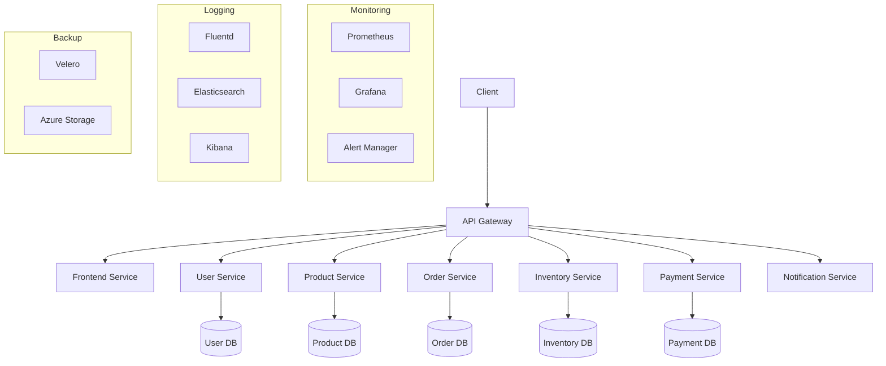
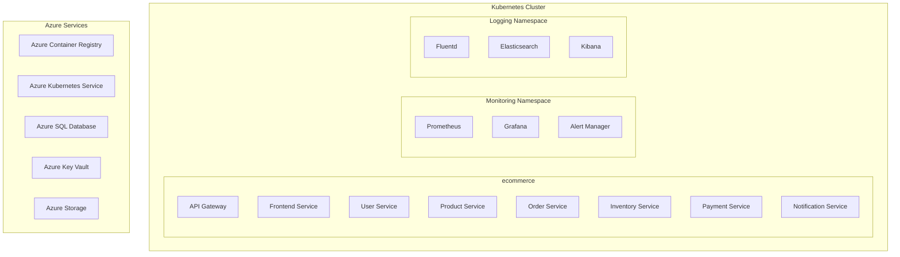
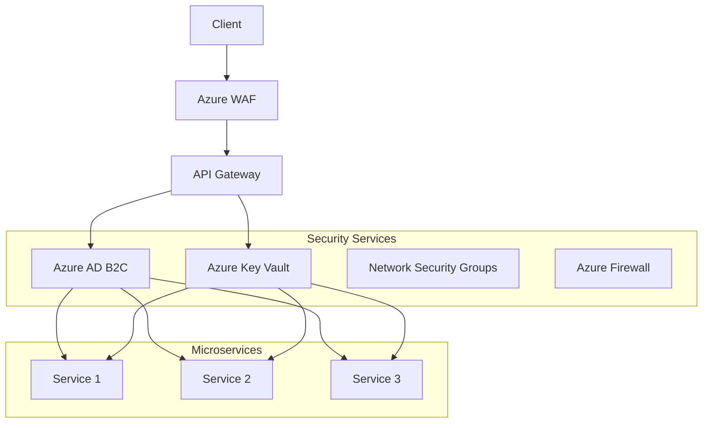
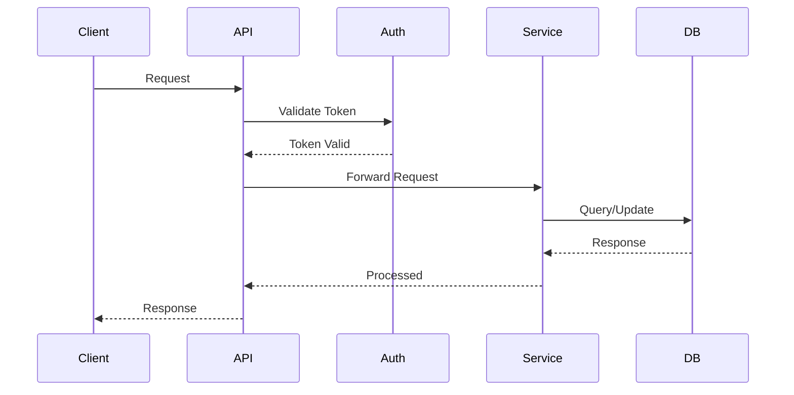

# E-Commerce Microservices Platform

A modern, scalable e-commerce platform built using microservices architecture, .NET 7, and Kubernetes.

## Architecture

### System Overview



### Deployment Architecture



### Security Architecture



The platform consists of the following microservices:

- **API Gateway**: Central entry point for all client requests
- **Frontend Service**: Web application for customer interactions
- **User Service**: User management and authentication
- **Product Service**: Product catalog management
- **Order Service**: Order processing and management
- **Inventory Service**: Stock management and tracking
- **Payment Service**: Payment processing and transactions
- **Notification Service**: Email and notification handling

### Data Flow



## Technology Stack

- **Backend**: .NET 7
- **Frontend**: ASP.NET Core MVC
- **Database**: SQL Server
- **Containerization**: Docker
- **Orchestration**: Kubernetes
- **Authentication**: Azure AD B2C
- **Monitoring**: Prometheus, Grafana
- **Logging**: ELK Stack (Elasticsearch, Logstash, Kibana)
- **CI/CD**: Azure DevOps
- **Backup**: Velero

## Prerequisites

### Development Environment
- .NET 7 SDK
- Docker Desktop
- Kubernetes (Minikube or Docker Desktop Kubernetes)
- Azure CLI
- kubectl
- Helm

### Azure Resources
- Azure subscription
- Azure AD B2C tenant
- Azure Container Registry
- Azure Kubernetes Service
- Azure SQL Database
- Azure Storage Account

## Getting Started

### Local Development

1. Clone the repository:
   ```bash
   git clone https://github.com/your-org/ecommerce-microservices.git
   cd ecommerce-microservices
   ```

2. Set up local development environment:
   ```bash
   # Install dependencies
   dotnet restore

   # Build the solution
   dotnet build

   # Run tests
   dotnet test
   ```

3. Configure environment variables:
   ```bash
   # Copy and update environment variables
   cp .env.example .env
   ```

4. Start local services:
   ```bash
   # Start all services using Docker Compose
   docker-compose up -d

   # Start specific service
   cd services/user-service
   dotnet run
   ```

### Kubernetes Deployment

1. Create namespace:
   ```bash
   kubectl apply -f infrastructure/kubernetes/namespace.yaml
   ```

2. Apply configurations:
   ```bash
   # Apply base configurations
   kubectl apply -f infrastructure/kubernetes/

   # Apply service-specific configurations
   kubectl apply -f services/user-service/k8s/
   kubectl apply -f services/product-service/k8s/
   # ... apply other services
   ```

3. Verify deployment:
   ```bash
   # Check all resources
   kubectl get all -n ecommerce

   # Check specific service
   kubectl get pods -n ecommerce -l app=user-service

   # View logs
   kubectl logs -n ecommerce -l app=user-service
   ```

## Monitoring and Logging

### Prometheus Metrics

- Service metrics available at `/metrics`
- Prometheus UI: `http://prometheus.ecommerce.svc.cluster.local:9090`
- Grafana dashboards: `http://grafana.ecommerce.svc.cluster.local:3000`

#### Available Metrics
- Request latency
- Error rates
- Resource utilization
- Custom business metrics

### Logging

- Logs are collected by Fluentd and stored in Elasticsearch
- Kibana UI: `http://kibana.ecommerce.svc.cluster.local:5601`
- Log retention: 30 days

#### Log Levels
- ERROR: Critical issues requiring immediate attention
- WARN: Potential issues that need monitoring
- INFO: General operational information
- DEBUG: Detailed information for troubleshooting

## Security

### Authentication and Authorization
- Azure AD B2C for user authentication
- JWT tokens for service-to-service communication
- Role-based access control (RBAC)

### Network Security
- All services run with non-root user
- Network policies restrict communication between services
- TLS encryption for all communications
- Regular security scanning and compliance checks

### Data Protection
- Encryption at rest using Azure Key Vault
- Encryption in transit using TLS 1.3
- Regular security audits and penetration testing

## Backup and Recovery

### Backup Configuration
- Daily automated backups using Velero
- Backup retention: 30 days
- Point-in-time recovery support

### Disaster Recovery
1. **Recovery Point Objective (RPO)**: 24 hours
2. **Recovery Time Objective (RTO)**: 4 hours
3. **Recovery Procedures**:
   ```bash
   # Restore from backup
   velero restore create --from-backup ecommerce-daily-backup
   
   # Verify restoration
   kubectl get all -n ecommerce
   ```

## CI/CD Pipeline

### Build Stage
- Code compilation
- Unit testing
- Security scanning
- Compliance checks

### Security Scan Stage
- Vulnerability scanning
- Static code analysis
- Dependency checking

### Deploy Stage
- Container image building
- Kubernetes deployment
- Post-deployment validation

## Compliance

### NIST 800-53
- Access Control (AC)
- Audit and Accountability (AU)
- Security Assessment and Authorization (CA)
- Configuration Management (CM)
- Contingency Planning (CP)

### HIPAA
- Technical Safeguards
- Physical Safeguards
- Administrative Safeguards

### GDPR
- Data Protection
- Data Subject Rights
- Data Processing Records

### PCI DSS
- Network Security
- Data Protection
- Vulnerability Management

### SOC 2
- Security
- Availability
- Processing Integrity
- Confidentiality
- Privacy

## Performance Optimization

### Service Level Optimization

1. **API Gateway**
   - Implement caching for frequently accessed data
   - Use circuit breakers for service resilience
   - Configure rate limiting
   ```yaml
   # Example rate limiting configuration
   rateLimiting:
     enabled: true
     limit: 1000
     period: 1m
     burst: 100
   ```

2. **Database Optimization**
   - Implement connection pooling
   - Use appropriate indexes
   - Configure query caching
   ```sql
   -- Example index creation
   CREATE INDEX idx_orders_user_id ON orders(user_id);
   CREATE INDEX idx_products_category ON products(category);
   ```

3. **Caching Strategy**
   - Use Redis for distributed caching
   - Implement cache invalidation
   - Configure cache expiration
   ```csharp
   // Example cache configuration
   services.AddStackExchangeRedisCache(options =>
   {
       options.Configuration = "redis:6379";
       options.InstanceName = "ecommerce_";
   });
   ```

### Kubernetes Optimization

1. **Resource Management**
   - Configure resource requests and limits
   - Implement horizontal pod autoscaling
   - Use vertical pod autoscaling
   ```yaml
   # Example HPA configuration
   apiVersion: autoscaling/v2
   kind: HorizontalPodAutoscaler
   metadata:
     name: user-service-hpa
   spec:
     scaleTargetRef:
       apiVersion: apps/v1
       kind: Deployment
       name: user-service
     minReplicas: 2
     maxReplicas: 10
     metrics:
     - type: Resource
       resource:
         name: cpu
         target:
           type: Utilization
           averageUtilization: 70
   ```

2. **Network Optimization**
   - Configure service mesh
   - Implement traffic splitting
   - Use network policies
   ```yaml
   # Example network policy
   apiVersion: networking.k8s.io/v1
   kind: NetworkPolicy
   metadata:
     name: allow-api-gateway
   spec:
     podSelector:
       matchLabels:
         app: user-service
     ingress:
     - from:
       - podSelector:
           matchLabels:
             app: api-gateway
     ports:
     - protocol: TCP
       port: 80
   ```

## Troubleshooting

### Common Issues

1. **Service Not Starting**
   ```bash
   # Check service logs
   kubectl logs -n ecommerce -l app=user-service
   
   # Check service status
   kubectl describe pod -n ecommerce -l app=user-service
   ```

2. **Database Connection Issues**
   ```bash
   # Check database connectivity
   kubectl exec -it -n ecommerce user-service-pod -- nc -zv db-host 1433
   
   # Check connection string
   kubectl get secret -n ecommerce db-credentials -o jsonpath='{.data.connectionString}' | base64 --decode
   ```

3. **Performance Issues**
   ```bash
   # Check resource usage
   kubectl top pods -n ecommerce
   
   # Check Prometheus metrics
   curl http://prometheus.ecommerce.svc.cluster.local:9090/api/v1/query?query=process_cpu_seconds_total
   ```

### Advanced Troubleshooting

1. **Distributed Tracing Issues**
   ```bash
   # Check Jaeger traces
   kubectl port-forward -n monitoring svc/jaeger-query 16686:16686
   # Access Jaeger UI at http://localhost:16686
   ```

2. **Service Mesh Issues**
   ```bash
   # Check Istio configuration
   istioctl analyze
   
   # Check service mesh traffic
   istioctl proxy-status
   ```

3. **Database Performance Issues**
   ```bash
   # Check slow queries
   kubectl exec -it -n ecommerce mysql-pod -- mysql -e "SHOW PROCESSLIST;"
   
   # Check table statistics
   kubectl exec -it -n ecommerce mysql-pod -- mysql -e "ANALYZE TABLE orders;"
   ```

4. **Kubernetes Cluster Issues**
   ```bash
   # Check cluster events
   kubectl get events --sort-by='.lastTimestamp'
   
   # Check node resources
   kubectl describe nodes
   
   # Check pod eviction reasons
   kubectl get events --field-selector reason=Evicted
   ```

### Performance Troubleshooting

1. **High Latency Issues**
   ```bash
   # Check service latency
   curl -o /dev/null -s -w "%{time_total}\n" http://api-gateway/metrics
   
   # Check database query performance
   kubectl exec -it -n ecommerce mysql-pod -- mysql -e "SHOW PROFILE;"
   ```

2. **Memory Issues**
   ```bash
   # Check memory usage
   kubectl top pods -n ecommerce
   
   # Check garbage collection
   kubectl exec -it -n ecommerce user-service-pod -- dotnet-counters monitor
   ```

3. **Network Issues**
   ```bash
   # Check network latency
   kubectl exec -it -n ecommerce user-service-pod -- ping api-gateway
   
   # Check network policies
   kubectl get networkpolicies -n ecommerce
   ```

## Development Guidelines

### Performance Best Practices

1. **Code Optimization**
   - Use async/await for I/O operations
   - Implement proper error handling
   - Use efficient data structures
   ```csharp
   // Example async operation
   public async Task<Order> GetOrderAsync(Guid orderId)
   {
       return await _orderRepository.GetByIdAsync(orderId);
   }
   ```

2. **Database Optimization**
   - Use appropriate indexes
   - Implement connection pooling
   - Use efficient queries
   ```csharp
   // Example efficient query
   public async Task<List<Order>> GetUserOrdersAsync(Guid userId)
   {
       return await _context.Orders
           .Where(o => o.UserId == userId)
           .Include(o => o.Items)
           .AsNoTracking()
           .ToListAsync();
   }
   ```

3. **Caching Strategy**
   - Implement distributed caching
   - Use cache invalidation
   - Configure appropriate TTL
   ```csharp
   // Example caching implementation
   public async Task<Product> GetProductAsync(Guid productId)
   {
       return await _cache.GetOrCreateAsync(
           $"product_{productId}",
           async entry =>
           {
               entry.SetAbsoluteExpiration(TimeSpan.FromMinutes(30));
               return await _productRepository.GetByIdAsync(productId);
           });
   }
   ```

## License

This project is licensed under the MIT License - see the [LICENSE](LICENSE) file for details.

## Support

For support, please contact:
- Technical Support: support@ecommerce.com
- Security Issues: security@ecommerce.com
- Compliance: compliance@ecommerce.com

### Support Hours
- Monday to Friday: 9:00 AM - 5:00 PM EST
- Emergency Support: 24/7 for critical issues

### Emergency Procedures

1. **Service Outage**
   - Contact on-call engineer
   - Check service health endpoints
   - Review recent deployments
   - Check monitoring alerts

2. **Security Incident**
   - Contact security team
   - Isolate affected services
   - Preserve logs and evidence
   - Follow incident response plan

3. **Data Loss**
   - Stop affected services
   - Initiate backup restoration
   - Verify data integrity
   - Resume services gradually 