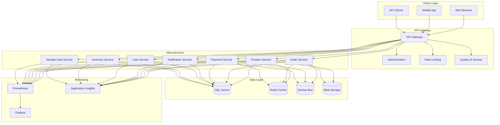
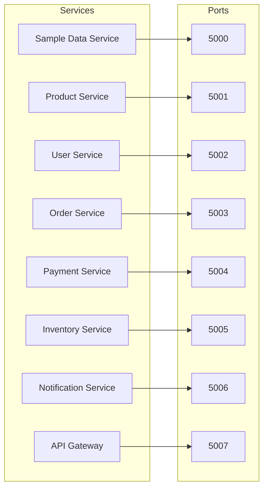

# Lear Cyber Tech E-Commerce Microservices Platform

<div align="center">
  
  
  <p>
    <em>Built with ❤️ by Lear Cyber Tech Team</em>
  </p>
  
  [](https://opensource.org/licenses/MIT)
  [](https://dev.azure.com/learcybertech/ECommerce/_build/latest?definitionId=1&branchName=main)
  [](https://dev.azure.com/learcybertech/ECommerce/_build/latest?definitionId=1&branchName=main)
</div>

## Authors
- **Dr. Libin Pallikunnel Kurian** - *Technical Lead* - [LinkedIn](https://www.linkedin.com/in/dr-libin-pallikunnel-kurian-88741530/)
- **Lear Cyber Tech Team** - *Development Team*

## Table of Contents
- [Overview](#overview)
- [Architecture](#architecture)
- [Services](#services)
- [Development](#development)
- [Deployment](#deployment)
- [Monitoring](#monitoring)
- [Security](#security)
- [Troubleshooting](#troubleshooting)
- [Contributing](#contributing)

## Overview
This platform is a modern e-commerce solution built using microservices architecture. It provides a scalable, secure, and maintainable system for online shopping.

### Key Features
- Microservices-based architecture
- Azure AD B2C authentication
- Distributed tracing
- Real-time notifications
- Inventory management
- Order processing
- Payment integration
- User management

## Architecture

### System Design


### Technology Stack
- **Backend**: .NET 7.0
- **Frontend**: React
- **Database**: SQL Server
- **Message Queue**: Azure Service Bus
- **Storage**: Azure Blob Storage
- **Authentication**: Azure AD B2C
- **Monitoring**: Prometheus + Grafana
- **Containerization**: Docker
- **Orchestration**: Kubernetes (optional)

## Services

### Core Services


1. [Sample Data Service](services/sample-data-service/README.md) (Port: 5000)
   - Initial data seeding
   - Development environment setup
   - [API Documentation](services/sample-data-service/docs/api.md)

2. [API Gateway](services/api-gateway/README.md) (Port: 5007)
   - Request routing
   - Authentication
   - Rate limiting
   - [Configuration Guide](services/api-gateway/docs/configuration.md)

3. [Product Service](services/product-service/README.md) (Port: 5001)
   - Product catalog management
   - Image storage
   - [API Documentation](services/product-service/docs/api.md)

4. [Order Service](services/order-service/README.md) (Port: 5003)
   - Order processing
   - Status management
   - [Workflow Documentation](services/order-service/docs/workflow.md)

5. [Payment Service](services/payment-service/README.md) (Port: 5004)
   - Payment processing
   - Transaction management
   - [Integration Guide](services/payment-service/docs/integration.md)

6. [Notification Service](services/notification-service/README.md) (Port: 5006)
   - Multi-channel notifications
   - Message queuing
   - [Channel Configuration](services/notification-service/docs/channels.md)

7. [User Service](services/user-service/README.md) (Port: 5002)
   - User management
   - Authentication
   - [Security Guide](services/user-service/docs/security.md)

8. [Inventory Service](services/inventory-service/README.md) (Port: 5005)
   - Stock management
   - Reservation system
   - [Operations Guide](services/inventory-service/docs/operations.md)

9. [Frontend Service](services/frontend-service/README.md) (Port: 5008)
   - User interface
   - API integration
   - [UI Components](services/frontend-service/docs/components.md)

### Supporting Services
- [Common Library](common/README.md)
  - Shared utilities
  - Base classes
  - [API Reference](common/docs/api.md)

- [Deployment Tools](deployment/README.md)
  - Configuration management
  - Release automation
  - [Deployment Guide](deployment/docs/guide.md)

## Development

### Environment Setup
1. **Prerequisites**
   - [.NET 7.0 SDK](https://dotnet.microsoft.com/download)
   - [PowerShell 7.0+](https://docs.microsoft.com/en-us/powershell/scripting/install/installing-powershell)
   - [SQL Server](https://www.microsoft.com/en-us/sql-server/sql-server-downloads)
   - [Docker](https://docs.docker.com/get-docker/) (optional)

2. **Configuration**
   - [Azure Setup Guide](docs/azure-setup.md)
   - [Local Development Guide](docs/local-development.md)
   - [Database Setup](docs/database-setup.md)

3. **Tools**
   - [Development Scripts](ProjectStartScript/README.md)
   - [Build Tools](pipelines/README.md)
   - [Testing Framework](tests/README.md)

### Getting Started
1. **Clone Repository**
   ```powershell
   git clone https://github.com/leomultimedia/LCT-Micro-Services.git
   cd LCT-Micro-Services
   ```

2. **Configure Environment**
   ```powershell
   # Set environment variables
   $env:ASPNETCORE_ENVIRONMENT = "Development"
   
   # Install tools
   dotnet tool install -g dotnet-ef
   dotnet tool install -g Microsoft.Web.LibraryManager.Cli
   ```

3. **Start Services**
   - [Using PowerShell Script](start-services.ps1)
   - [Using Docker Compose](docker-compose.yml)
   - [Manual Startup Guide](docs/manual-startup.md)

## Deployment

### Environments
1. **Development**
   - [Local Setup Guide](docs/development-setup.md)
   - [Database Migrations](docs/migrations.md)
   - [Testing Guide](docs/testing.md)

2. **Staging**
   - [Deployment Checklist](deployment/docs/checklist.md)
   - [Configuration Management](deployment/ChangeConfigurator/README.md)
   - [Release Notes](deployment/docs/release-notes.md)

3. **Production**
   - [Infrastructure Setup](infrastructure/README.md)
   - [Scaling Guide](docs/scaling.md)
   - [Disaster Recovery](docs/disaster-recovery.md)

### CI/CD
- [Build Pipeline](pipelines/build.yml)
- [Release Pipeline](pipelines/release.yml)
- [Quality Gates](pipelines/quality-gates.md)

## Monitoring

### Tools
- [Prometheus Configuration](prometheus.yml)
- [Grafana Dashboards](grafana/README.md)
- [Application Insights](docs/application-insights.md)

### Metrics
- [Service Health](docs/health-checks.md)
- [Performance Metrics](docs/performance-metrics.md)
- [Business Metrics](docs/business-metrics.md)

### Logging
- [Logging Configuration](docs/logging.md)
- [Log Analysis](docs/log-analysis.md)
- [Alerting Rules](docs/alerting.md)

## Security

### Authentication
- [Azure AD B2C Setup](docs/auth-setup.md)
- [Token Management](docs/token-management.md)
- [Role-Based Access](docs/rbac.md)

### Data Protection
- [Encryption Guide](docs/encryption.md)
- [Key Management](docs/key-management.md)
- [Compliance](docs/compliance.md)

### Network Security
- [Firewall Rules](docs/firewall.md)
- [SSL/TLS Configuration](docs/ssl.md)
- [Network Isolation](docs/network-isolation.md)

## Troubleshooting

### Common Issues
1. [Port Conflicts](docs/port-conflicts.md)
2. [Authentication Problems](docs/auth-troubleshooting.md)
3. [Database Issues](docs/database-troubleshooting.md)
4. [Service Communication](docs/service-communication.md)
5. [Performance Issues](docs/performance-troubleshooting.md)

### Support
- [Issue Tracking](.github/ISSUE_TEMPLATE.md)
- [Support Process](docs/support-process.md)
- [FAQ](docs/faq.md)

## Contributing

### Guidelines
- [Code Style](docs/code-style.md)
- [Pull Request Process](.github/PULL_REQUEST_TEMPLATE.md)
- [Documentation Standards](docs/documentation-standards.md)

### Development Process
1. Fork the repository
2. Create a feature branch
3. Commit your changes
4. Push to the branch
5. Create a Pull Request

## License
This project is licensed under the MIT License - see the [LICENSE](LICENSE) file for details.

## Acknowledgments
- [Contributors](docs/contributors.md)
- [Third-Party Libraries](docs/third-party.md)
- [References](docs/references.md)

<div align="center">
  <p>
    <em>© 2024 Lear Cyber Tech. All rights reserved.</em>
  </p>
</div> 
