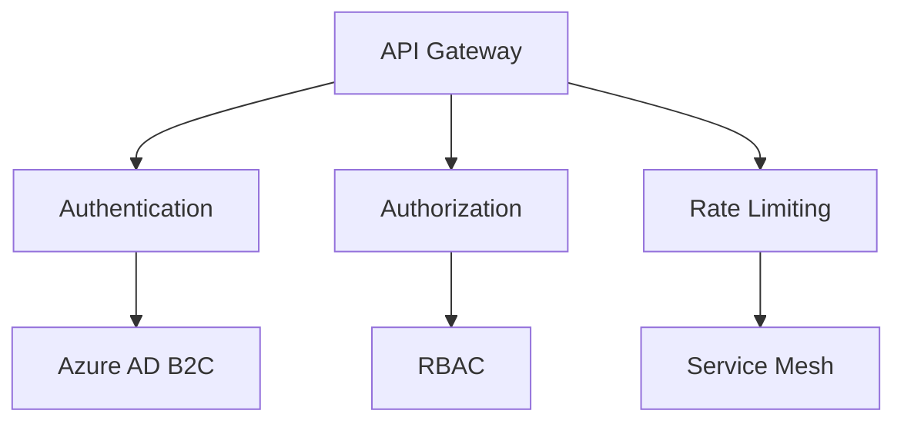

# Compliance Documentation

## Overview
This document outlines the compliance measures implemented in the ECommerce microservices architecture to meet various regulatory requirements including NIST, HIPAA, GDPR, and PCI DSS.

## NIST Compliance

### Security Controls
- **Access Control (AC)**
  - Role-based access control (RBAC) implemented across all services
  - Multi-factor authentication (MFA) required for administrative access
  - Session management with automatic timeout

- **Audit and Accountability (AU)**
  - Comprehensive logging of all system events
  - Centralized log management with 90-day retention
  - Regular audit trail reviews

- **System and Communications Protection (SC)**
  - TLS 1.3 encryption for all communications
  - Network segmentation between services
  - API Gateway with rate limiting and DDoS protection

## HIPAA Compliance

### Protected Health Information (PHI) Protection
- **Technical Safeguards**
  - Encryption at rest for all PHI data
  - Secure transmission protocols
  - Access controls with audit logging

- **Administrative Safeguards**
  - Regular security risk assessments
  - Employee training on PHI handling
  - Incident response procedures

## GDPR Compliance

### Data Protection
- **Data Subject Rights**
  - Right to access
  - Right to erasure
  - Right to data portability
  - Right to rectification

- **Data Processing**
  - Data minimization
  - Purpose limitation
  - Storage limitation
  - Lawful basis for processing

### Technical Measures
- **Data Encryption**
  - AES-256 encryption for data at rest
  - TLS 1.3 for data in transit
  - Key management system

- **Access Control**
  - Role-based access control
  - Regular access reviews
  - Authentication and authorization

## PCI DSS Compliance

### Payment Data Security
- **Cardholder Data Protection**
  - No storage of full card numbers
  - Tokenization for payment processing
  - Secure transmission of payment data

- **Security Controls**
  - Network segmentation
  - Regular vulnerability scanning
  - Penetration testing
  - Security monitoring

## Implementation Details

### Security Architecture

### Monitoring and Logging
- Prometheus metrics collection
- Grafana dashboards
- Centralized logging with ELK stack
- Security Information and Event Management (SIEM)

### Regular Compliance Activities
1. Quarterly security assessments
2. Annual penetration testing
3. Monthly vulnerability scanning
4. Daily security monitoring
5. Continuous compliance monitoring

## Compliance Logos
The following compliance logos are displayed in the application footer:

- NIST SP 800-53
- HIPAA
- GDPR
- PCI DSS

## Contact Information
For compliance-related inquiries, please contact:
- Security Team: security@ecommerce.com
- Compliance Officer: compliance@ecommerce.com
- Data Protection Officer: dpo@ecommerce.com 