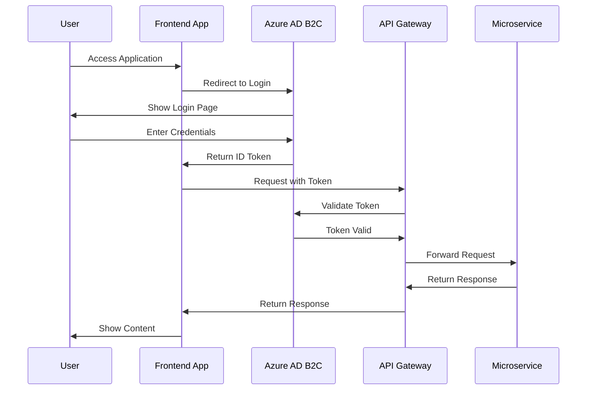
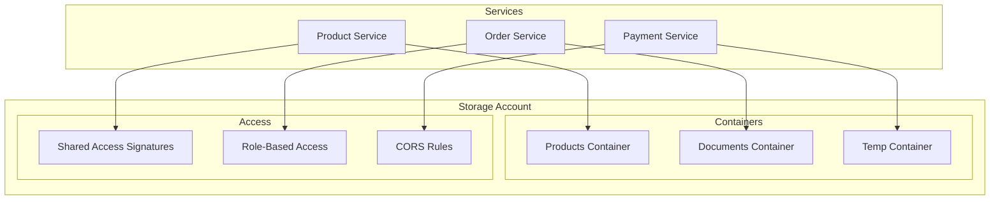
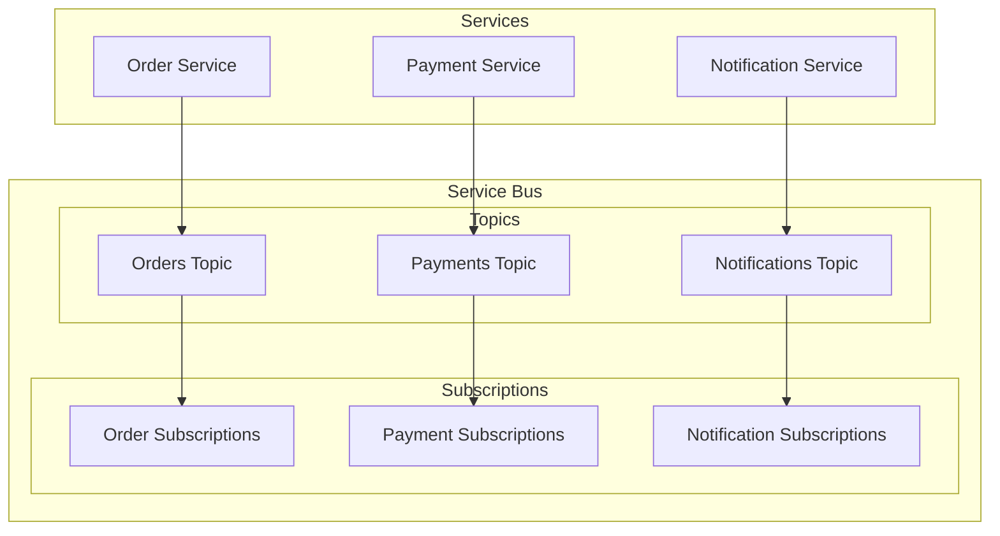
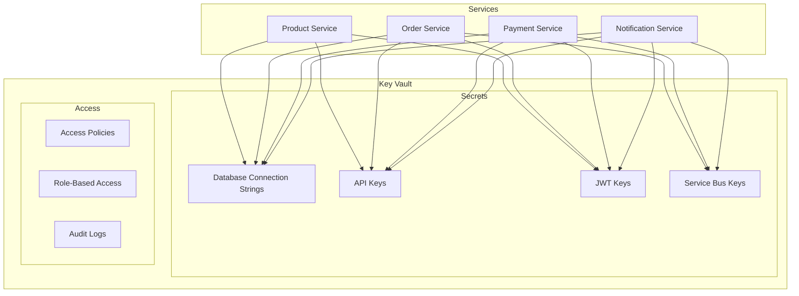
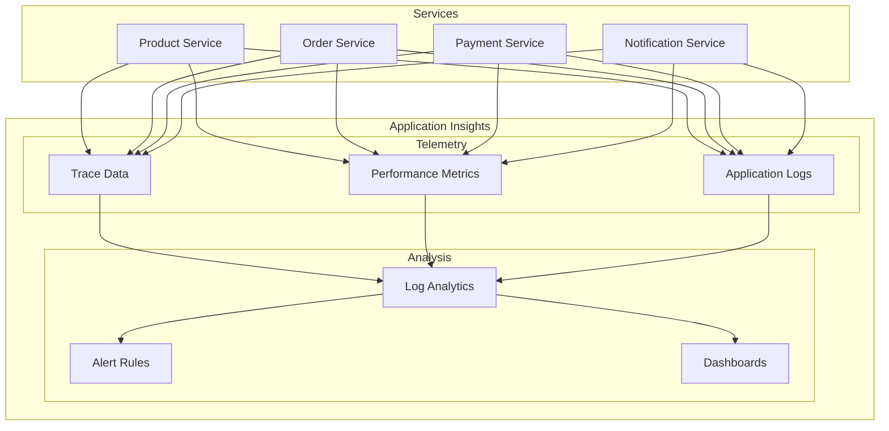
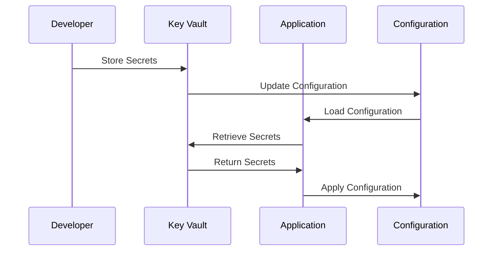

# Azure Setup Guide

## Azure Infrastructure Architecture

```mermaid
graph TB
    subgraph Azure Resources
        subgraph Identity
            B2C[Azure AD B2C]
            SP[Service Principal]
        end

        subgraph Storage
            SA[Storage Account]
            Blob[Blob Storage]
            Queue[Queue Storage]
        end

        subgraph Messaging
            SB[Service Bus]
            Topics[Topics]
            Queues[Queues]
        end

        subgraph Security
            KV[Key Vault]
            Secrets[Secrets]
            Keys[Keys]
        end

        subgraph Monitoring
            AI[Application Insights]
            Logs[Log Analytics]
            Metrics[Metrics]
        end
    end

    subgraph Microservices
        PS[Product Service]
        OS[Order Service]
        PMS[Payment Service]
        NS[Notification Service]
    end

    PS --> B2C
    OS --> B2C
    PMS --> B2C
    NS --> B2C

    PS --> SA
    OS --> SA
    PMS --> SA

    OS --> SB
    PMS --> SB
    NS --> SB

    PS --> KV
    OS --> KV
    PMS --> KV
    NS --> KV

    PS --> AI
    OS --> AI
    PMS --> AI
    NS --> AI
```


## Azure AD B2C Authentication Flow


## Azure Storage Architecture


## Azure Service Bus Architecture


## Azure Key Vault Architecture


## Azure Monitoring Architecture


## Azure Configuration Flow


## About This Guide
This guide is part of the Lear Cyber Tech E-Commerce Microservices Platform documentation. It provides detailed instructions for setting up and configuring Azure resources for the platform.

**Author**: Dr. Libin Pallikunnel Kurian - *Technical Lead* - [LinkedIn](https://www.linkedin.com/in/dr-libin-pallikunnel-kurian-88741530/)

**Company**: Lear Cyber Tech

**Last Updated**: April 2024

## Prerequisites
- Azure subscription
- Azure CLI or PowerShell
- Azure AD B2C tenant

## 1. Azure AD B2C Configuration

<div align="center">
  
  <p><em>Figure 2: Azure AD B2C Authentication Flow</em></p>
</div>

### Create Azure AD B2C Tenant
1. Sign in to the [Azure Portal](https://portal.azure.com)
2. Create a new Azure AD B2C tenant:
   - Navigate to Azure AD B2C
   - Click "Create a tenant"
   - Fill in the required information
   - Note down the tenant name and ID

### Register Applications
1. Register the API Gateway:
   ```powershell
   az ad app create --display-name "ECommerce API Gateway" --sign-in-audience AzureADandPersonalMicrosoftAccount
   ```

2. Register the Frontend Application:
   ```powershell
   az ad app create --display-name "ECommerce Frontend" --sign-in-audience AzureADandPersonalMicrosoftAccount
   ```

3. Configure API Permissions:
   - products.read
   - products.write
   - orders.read
   - orders.write
   - payments.process
   - users.manage
   - inventory.manage

### Configure User Flows
1. Create Sign-up and Sign-in policy:
   - Navigate to User flows
   - Create a new flow
   - Select "Sign up and sign in"
   - Configure attributes and claims

## 2. Azure Storage Account

<div align="center">
  
  <p><em>Figure 3: Azure Storage Architecture</em></p>
</div>

### Create Storage Account
1. Create a new storage account:
   ```powershell
   az storage account create --name "ecommercestorage" --resource-group "ecommerce-rg" --location "eastus" --sku Standard_LRS
   ```

2. Create containers:
   - products: For product images
   - documents: For order documents
   - temp: For temporary files

### Configure Access
1. Generate connection string:
   ```powershell
   az storage account show-connection-string --name "ecommercestorage" --resource-group "ecommerce-rg"
   ```

2. Set up CORS:
   ```powershell
   az storage cors add --services b --methods GET PUT --origins "*" --allowed-headers "*" --exposed-headers "*" --max-age 200
   ```

## 3. Azure Service Bus

<div align="center">
  
  <p><em>Figure 4: Azure Service Bus Architecture</em></p>
</div>

### Create Service Bus
1. Create a namespace:
   ```powershell
   az servicebus namespace create --name "ecommerce-sb" --resource-group "ecommerce-rg" --location "eastus" --sku Standard
   ```

2. Create queues:
   - orders: For order processing
   - notifications: For sending notifications
   - payments: For payment processing

### Configure Access
1. Create shared access policies:
   ```powershell
   az servicebus queue authorization-rule create --resource-group "ecommerce-rg" --namespace-name "ecommerce-sb" --queue-name "orders" --name "orders-policy" --rights Send Listen
   ```

2. Get connection string:
   ```powershell
   az servicebus namespace authorization-rule keys list --resource-group "ecommerce-rg" --namespace-name "ecommerce-sb" --name "RootManageSharedAccessKey"
   ```

## 4. Azure Key Vault

<div align="center">
  
  <p><em>Figure 5: Azure Key Vault Architecture</em></p>
</div>

### Create Key Vault
1. Create a vault:
   ```powershell
   az keyvault create --name "ecommerce-kv" --resource-group "ecommerce-rg" --location "eastus"
   ```

2. Add secrets:
   - Database connection strings
   - API keys
   - JWT signing keys
   - Service bus connection strings

### Configure Access
1. Set access policies:
   ```powershell
   az keyvault set-policy --name "ecommerce-kv" --resource-group "ecommerce-rg" --spn $servicePrincipalId --secret-permissions get list
   ```

## 5. Application Insights

<div align="center">
  
  <p><em>Figure 6: Azure Monitoring Architecture</em></p>
</div>

### Create Resource
1. Create Application Insights:
   ```powershell
   az monitor app-insights component create --app "ecommerce-ai" --location "eastus" --resource-group "ecommerce-rg"
   ```

2. Get instrumentation key:
   ```powershell
   az monitor app-insights component show --app "ecommerce-ai" --resource-group "ecommerce-rg"
   ```

## 6. Update Configuration

<div align="center">
  
  <p><em>Figure 7: Azure Configuration Management Flow</em></p>
</div>

### Update appsettings.json
```json
{
  "AzureAdB2C": {
    "Instance": "https://your-tenant.b2clogin.com",
    "ClientId": "your-client-id",
    "Domain": "your-tenant.onmicrosoft.com",
    "SignUpSignInPolicyId": "B2C_1_SignUpSignIn"
  },
  "AzureStorage": {
    "ConnectionString": "your-storage-connection-string",
    "ContainerNames": {
      "Products": "products",
      "Documents": "documents",
      "Temp": "temp"
    }
  },
  "AzureServiceBus": {
    "ConnectionString": "your-service-bus-connection-string",
    "QueueNames": {
      "Orders": "orders",
      "Notifications": "notifications",
      "Payments": "payments"
    }
  },
  "AzureKeyVault": {
    "VaultUri": "https://ecommerce-kv.vault.azure.net/",
    "TenantId": "your-tenant-id",
    "ClientId": "your-client-id",
    "ClientSecret": "your-client-secret"
  },
  "ApplicationInsights": {
    "InstrumentationKey": "your-instrumentation-key"
  }
}
```

## Troubleshooting

### Common Issues
1. **Authentication Errors**
   - Verify tenant configuration
   - Check application registrations
   - Validate redirect URIs

2. **Storage Access Issues**
   - Verify connection string
   - Check CORS configuration
   - Validate container permissions

3. **Service Bus Connection Issues**
   - Verify namespace configuration
   - Check queue permissions
   - Validate connection string

4. **Key Vault Access Issues**
   - Verify access policies
   - Check service principal permissions
   - Validate secret names

### Support
- [Azure Documentation](https://docs.microsoft.com/en-us/azure/)
- [Azure Status](https://status.azure.com/)
- [Azure Support](https://azure.microsoft.com/en-us/support/options/)

<div align="center">
  <p>
    <em>© 2024 Lear Cyber Tech. All rights reserved.</em>
  </p>
</div> 