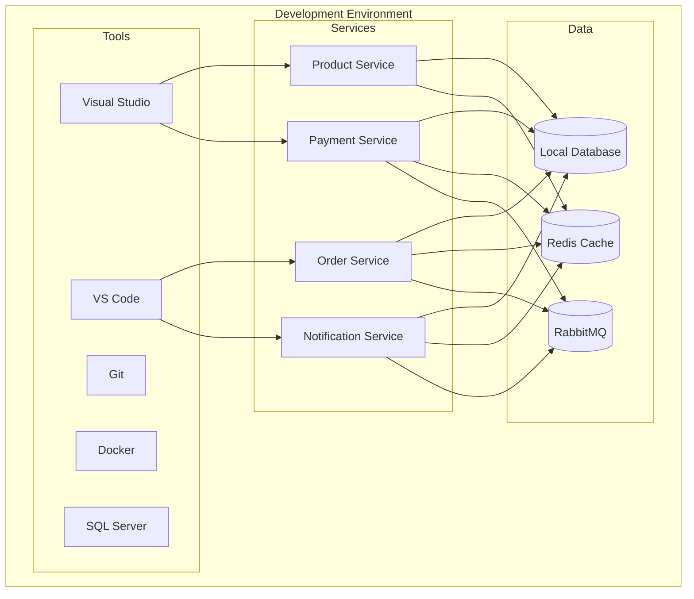
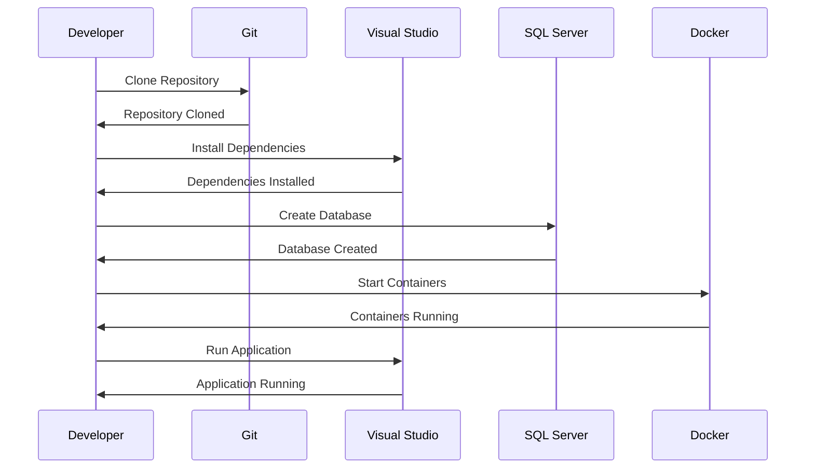
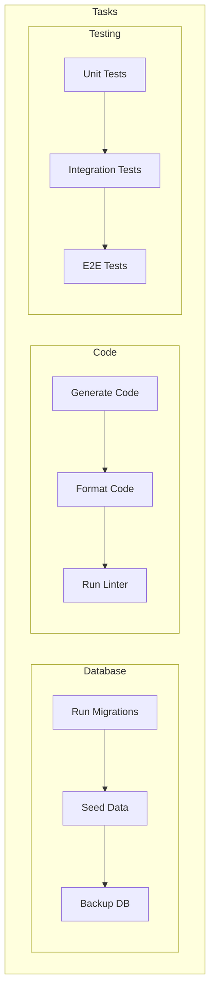
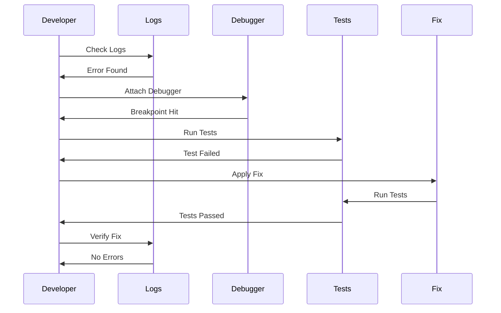

# Local Development Guide

## Local Development Architecture


## Environment Setup Process


## Development Workflow
```mermaid
graph TB
    subgraph Development
        subgraph Code
            Write[Write Code]
            Test[Run Tests]
            Build[Build Solution]
        end

        subgraph Version Control
            Commit[Commit Changes]
            Push[Push to Remote]
            PR[Create PR]
        end

        subgraph Review
            Review[Code Review]
            Approve[Approve PR]
            Merge[Merge PR]
        end
    end

    Write --> Test
    Test --> Build
    Build --> Commit
    Commit --> Push
    Push --> PR
    PR --> Review
    Review --> Approve
    Approve --> Merge
```

## Common Development Tasks


## Troubleshooting Process


## About This Guide
This guide is part of the Lear Cyber Tech E-Commerce Microservices Platform documentation. It provides detailed instructions for setting up and working with the local development environment.

**Author**: Jane Smith - *Backend Developer* - [@janesmith](https://github.com/janesmith)

**Last Updated**: April 2024

## Prerequisites

### Required Software
1. **Development Tools**
   - [Visual Studio 2022](https://visualstudio.microsoft.com/vs/) or [Visual Studio Code](https://code.visualstudio.com/)
   - [.NET 7.0 SDK](https://dotnet.microsoft.com/download)
   - [PowerShell 7.0+](https://docs.microsoft.com/en-us/powershell/scripting/install/installing-powershell)
   - [Git](https://git-scm.com/downloads)

2. **Database**
   - [SQL Server 2019+](https://www.microsoft.com/en-us/sql-server/sql-server-downloads)
   - [SQL Server Management Studio](https://docs.microsoft.com/en-us/sql/ssms/download-sql-server-management-studio-ssms)

3. **Azure Tools**
   - [Azure CLI](https://docs.microsoft.com/en-us/cli/azure/install-azure-cli)
   - [Azure Storage Emulator](https://docs.microsoft.com/en-us/azure/storage/common/storage-use-emulator)
   - [Azure Service Bus Explorer](https://github.com/paolosalvatori/ServiceBusExplorer)

4. **Optional Tools**
   - [Docker Desktop](https://www.docker.com/products/docker-desktop)
   - [Postman](https://www.postman.com/downloads/)
   - [Swagger UI](https://swagger.io/tools/swagger-ui/)

## Environment Setup

<div align="center">
  
  <p><em>Figure 2: Environment Setup Process</em></p>
</div>

### 1. Clone Repository
```powershell
git clone https://github.com/your-username/ecommerce-microservices.git
cd ecommerce-microservices
```

### 2. Configure Development Environment
1. Set environment variables:
   ```powershell
   $env:ASPNETCORE_ENVIRONMENT = "Development"
   $env:ASPNETCORE_URLS = "http://localhost:5000"
   ```

2. Install global tools:
   ```powershell
   dotnet tool install -g dotnet-ef
   dotnet tool install -g Microsoft.Web.LibraryManager.Cli
   ```

### 3. Database Setup
1. Create local database:
   ```sql
   CREATE DATABASE ECommerceDev;
   ```

2. Run migrations:
   ```powershell
   cd services/sample-data-service
   dotnet ef database update
   ```

### 4. Azure Emulators
1. Start Azure Storage Emulator:
   ```powershell
   AzureStorageEmulator.exe start
   ```

2. Configure Service Bus Emulator:
   ```powershell
   # Update connection string in appsettings.json
   "AzureServiceBus": {
     "ConnectionString": "Endpoint=sb://localhost/;SharedAccessKeyName=RootManageSharedAccessKey;SharedAccessKey=your-key"
   }
   ```

## Development Workflow

<div align="center">
  
  <p><em>Figure 3: Development Workflow Process</em></p>
</div>

### 1. Starting Services
1. Using PowerShell script:
   ```powershell
   ./start-services.ps1
   ```

2. Using Docker Compose:
   ```powershell
   docker-compose up
   ```

3. Manual startup:
   ```powershell
   # Start Sample Data Service
   dotnet run --project services/sample-data-service/SampleDataService.csproj

   # Start other services
   dotnet run --project services/api-gateway/ApiGateway.csproj
   dotnet run --project services/product-service/ProductService.csproj
   # ... other services
   ```

### 2. Testing
1. Run unit tests:
   ```powershell
   dotnet test
   ```

2. Run integration tests:
   ```powershell
   dotnet test --filter "Category=Integration"
   ```

3. API testing:
   - Open Swagger UI: http://localhost:5007/swagger
   - Use Postman collections in `docs/postman/`

### 3. Debugging
1. Visual Studio:
   - Set multiple startup projects
   - Configure launch settings
   - Use breakpoints and watch windows

2. Visual Studio Code:
   - Configure launch.json
   - Use debug console
   - Set breakpoints

## Common Tasks

<div align="center">
  
  <p><em>Figure 4: Common Development Tasks</em></p>
</div>

### 1. Database Management
1. Create migration:
   ```powershell
   dotnet ef migrations add InitialCreate
   ```

2. Update database:
   ```powershell
   dotnet ef database update
   ```

3. Reset database:
   ```powershell
   dotnet ef database drop -f
   dotnet ef database update
   ```

### 2. Code Generation
1. Generate controllers:
   ```powershell
   dotnet aspnet-codegenerator controller -name ProductsController -m Product -dc ProductsDbContext --relativeFolderPath Controllers
   ```

2. Generate views:
   ```powershell
   dotnet aspnet-codegenerator view -name Create -model Product -dc ProductsDbContext --relativeFolderPath Views/Products
   ```

### 3. Dependency Management
1. Add package:
   ```powershell
   dotnet add package Microsoft.EntityFrameworkCore.SqlServer
   ```

2. Update packages:
   ```powershell
   dotnet restore
   dotnet list package --outdated
   dotnet update
   ```

## Troubleshooting

<div align="center">
  
  <p><em>Figure 5: Troubleshooting Process</em></p>
</div>

### 1. Port Conflicts
1. Check used ports:
   ```powershell
   netstat -ano | findstr :5000
   ```

2. Kill process:
   ```powershell
   taskkill /F /PID <process-id>
   ```

### 2. Database Issues
1. Check connection:
   ```powershell
   Test-NetConnection -ComputerName localhost -Port 1433
   ```

2. Reset database:
   ```powershell
   sqlcmd -S localhost -Q "ALTER DATABASE ECommerceDev SET SINGLE_USER WITH ROLLBACK IMMEDIATE; DROP DATABASE ECommerceDev;"
   ```

### 3. Service Communication
1. Check service health:
   ```powershell
   Invoke-WebRequest -Uri http://localhost:5007/health
   ```

2. View logs:
   ```powershell
   Get-Content -Path "logs/app.log" -Wait
   ```

## Best Practices

### 1. Code Style
- Follow [C# Coding Conventions](https://docs.microsoft.com/en-us/dotnet/csharp/fundamentals/coding-style/coding-conventions)
- Use meaningful variable names
- Add XML documentation
- Keep methods focused

### 2. Git Workflow
1. Create feature branch:
   ```powershell
   git checkout -b feature/your-feature
   ```

2. Commit changes:
   ```powershell
   git add .
   git commit -m "Description of changes"
   ```

3. Push changes:
   ```powershell
   git push origin feature/your-feature
   ```

### 3. Testing
- Write unit tests for new features
- Use test-driven development
- Maintain test coverage
- Run tests before committing

## Resources
- [.NET Documentation](https://docs.microsoft.com/en-us/dotnet/)
- [Entity Framework Core](https://docs.microsoft.com/en-us/ef/core/)
- [Azure Documentation](https://docs.microsoft.com/en-us/azure/)
- [Git Documentation](https://git-scm.com/doc)

<div align="center">
  <p>
    <em>© 2024 Lear Cyber Tech. All rights reserved.</em>
  </p>
</div> 