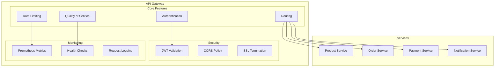
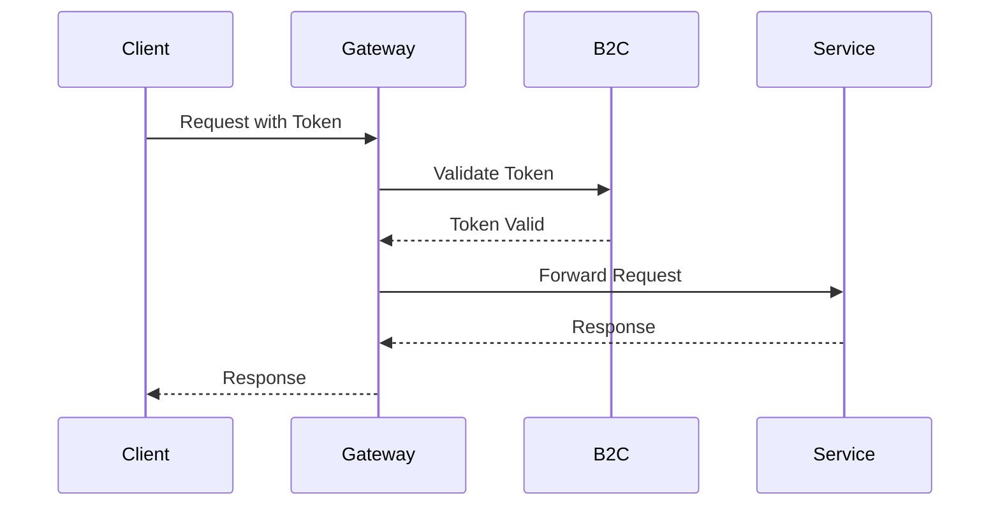

# API Gateway Documentation

## Overview
The API Gateway serves as the single entry point for all client requests to the E-Commerce Microservices Platform. It handles authentication, routing, rate limiting, and quality of service.

## Architecture


## Configuration

### Authentication
```json
{
  "AzureAdB2C": {
    "Instance": "https://your-tenant.b2clogin.com",
    "ClientId": "your-client-id",
    "Domain": "your-tenant.onmicrosoft.com",
    "SignUpSignInPolicyId": "B2C_1_SignUpSignIn"
  }
}
```

### Routing
```json
{
  "Routes": [
    {
      "DownstreamPathTemplate": "/api/products/{everything}",
      "DownstreamScheme": "http",
      "DownstreamHostAndPorts": [
        {
          "Host": "localhost",
          "Port": 5001
        }
      ],
      "UpstreamPathTemplate": "/products/{everything}",
      "UpstreamHttpMethod": [ "GET", "POST", "PUT", "DELETE" ]
    }
  ]
}
```

### Rate Limiting
```json
{
  "RateLimitOptions": {
    "ClientIdHeader": "X-ClientId",
    "QuotaExceededMessage": "Rate limit exceeded",
    "DisableRateLimitHeaders": false,
    "HttpStatusCode": 429
  }
}
```

### Quality of Service
```json
{
  "QoSOptions": {
    "ExceptionsAllowedBeforeBreaking": 3,
    "DurationOfBreak": 5,
    "TimeoutValue": 5000
  }
}
```

## Security

### Authentication Flow


### CORS Configuration
```csharp
services.AddCors(options =>
{
    options.AddPolicy("AllowAll",
        builder => builder
            .AllowAnyOrigin()
            .AllowAnyMethod()
            .AllowAnyHeader());
});
```

## Monitoring

### Health Checks
```csharp
services.AddHealthChecks()
    .AddCheck<GatewayHealthCheck>("gateway_health_check");
```

### Metrics
```csharp
services.AddPrometheusMetrics(options =>
{
    options.EnableHttpMetrics = true;
    options.EnableGcMetrics = true;
});
```

## Troubleshooting

### Common Issues
1. **Authentication Failures**
   - Verify Azure AD B2C configuration
   - Check token validation
   - Validate client credentials

2. **Routing Issues**
   - Check route configuration
   - Verify service availability
   - Validate request paths

3. **Rate Limiting**
   - Monitor client usage
   - Adjust rate limits
   - Check quota configuration

4. **Quality of Service**
   - Monitor circuit breaker status
   - Check timeout values
   - Verify retry policies

## API Reference

### Endpoints
- `GET /health` - Health check endpoint
- `GET /metrics` - Prometheus metrics
- `GET /swagger` - API documentation

### Headers
- `X-ClientId` - Client identification
- `Authorization` - Bearer token
- `X-Request-Id` - Request tracking

## Development

### Prerequisites
- .NET 7.0 SDK
- Azure AD B2C tenant
- Ocelot package

### Setup
1. Install dependencies:
   ```powershell
   dotnet add package Ocelot
   dotnet add package Microsoft.AspNetCore.Authentication.JwtBearer
   ```

2. Configure environment:
   ```powershell
   $env:ASPNETCORE_ENVIRONMENT = "Development"
   ```

3. Start service:
   ```powershell
   dotnet run --project services/api-gateway/ApiGateway.csproj
   ```

## Support
- [Ocelot Documentation](https://ocelot.readthedocs.io/)
- [Azure AD B2C Documentation](https://docs.microsoft.com/en-us/azure/active-directory-b2c/)
- [Issue Tracking](.github/ISSUE_TEMPLATE.md)

<div align="center">
  <p>
    <em>© 2024 Lear Cyber Tech. All rights reserved.</em>
  </p>
</div> 