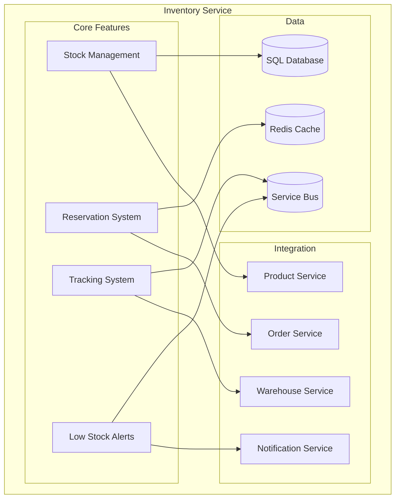
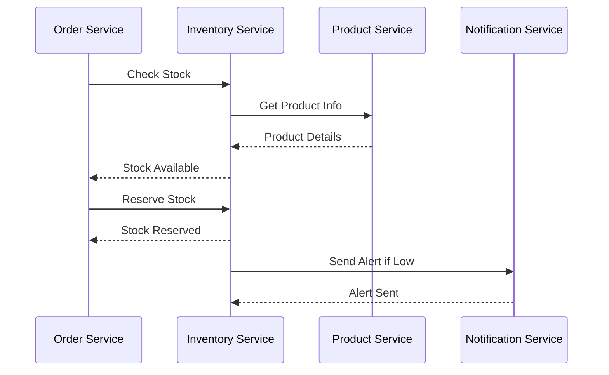
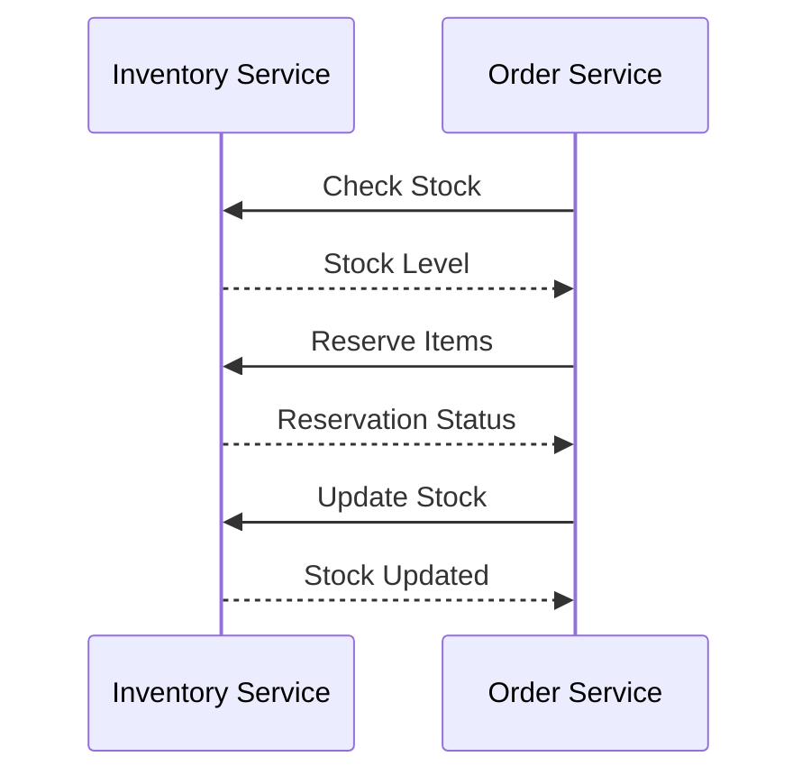
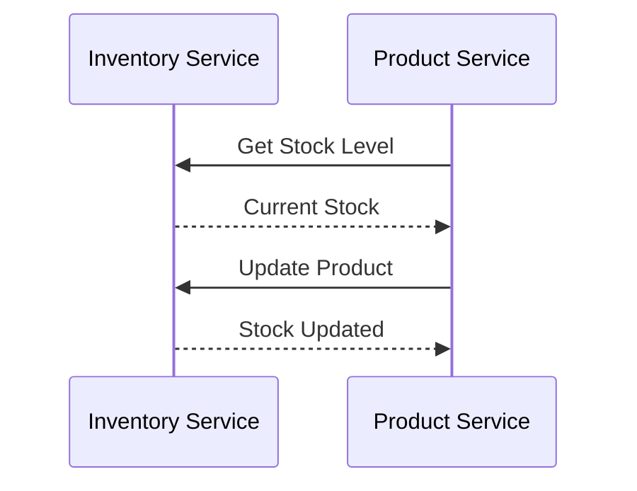
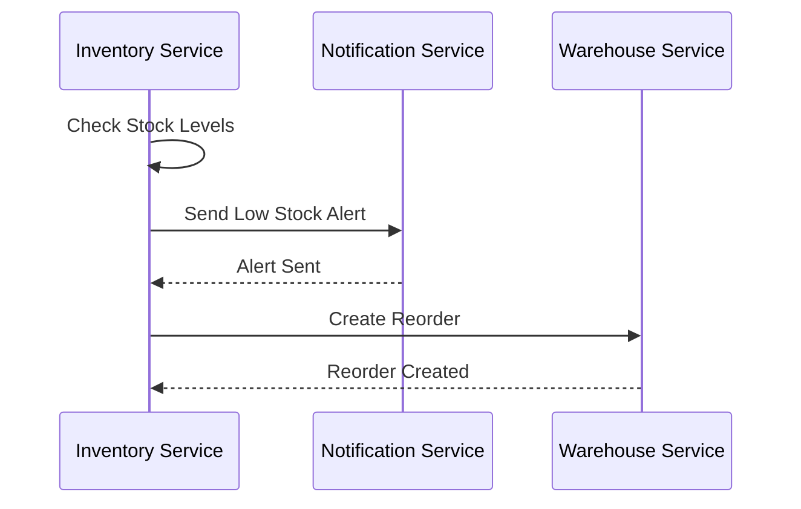
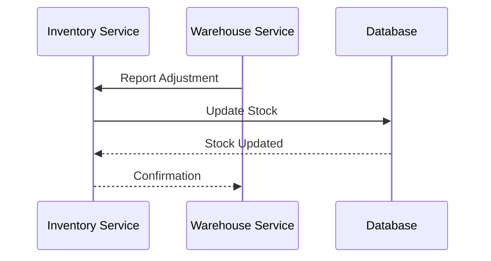

# Inventory Service Documentation

## Overview
The Inventory Service manages product inventory, stock levels, and reservations for the E-Commerce platform, ensuring accurate stock tracking and availability.

## Architecture


## Data Models

### InventoryItem
```csharp
public class InventoryItem
{
    public int Id { get; set; }
    public int ProductId { get; set; }
    public Product Product { get; set; }
    public int Quantity { get; set; }
    public int ReservedQuantity { get; set; }
    public int ReorderLevel { get; set; }
    public string Location { get; set; }
    public DateTime LastUpdated { get; set; }
}
```

### StockMovement
```csharp
public class StockMovement
{
    public int Id { get; set; }
    public int InventoryItemId { get; set; }
    public InventoryItem InventoryItem { get; set; }
    public int Quantity { get; set; }
    public string Type { get; set; }
    public string Reference { get; set; }
    public DateTime CreatedAt { get; set; }
}
```

## Inventory Workflow


## API Endpoints

### Inventory
- `GET /api/inventory` - Get all inventory items
- `GET /api/inventory/{id}` - Get inventory item by ID
- `GET /api/inventory/product/{productId}` - Get inventory by product
- `PUT /api/inventory/{id}` - Update inventory item
- `POST /api/inventory/adjust` - Adjust stock level

### Stock Movements
- `GET /api/stock-movements` - Get all stock movements
- `GET /api/stock-movements/{id}` - Get movement by ID
- `POST /api/stock-movements` - Record movement
- `GET /api/stock-movements/product/{productId}` - Get product movements

## Configuration

### Database
```json
{
  "ConnectionStrings": {
    "DefaultConnection": "Server=localhost;Database=ECommerce;User Id=sa;Password=your_password;"
  }
}
```

### Redis Cache
```json
{
  "Redis": {
    "ConnectionString": "localhost:6379",
    "InstanceName": "Inventory:"
  }
}
```

### Service Bus
```json
{
  "AzureServiceBus": {
    "ConnectionString": "your_service_bus_connection_string",
    "QueueName": "inventory"
  }
}
```

## Health Checks

### Database Health
```csharp
services.AddHealthChecks()
    .AddDbContextCheck<InventoryDbContext>()
    .AddCheck<InventoryHealthCheck>("inventory_health_check");
```

### Cache Health
```csharp
services.AddHealthChecks()
    .AddRedis("localhost:6379", name: "redis_health_check");
```

## Monitoring

### Metrics
```csharp
services.AddPrometheusMetrics(options =>
{
    options.EnableHttpMetrics = true;
    options.EnableGcMetrics = true;
});
```

### Logging
```csharp
services.AddLogging(builder =>
{
    builder.AddConsole();
    builder.AddApplicationInsights();
});
```

## Integration

### Order Service


### Product Service


## Development

### Prerequisites
- .NET 7.0 SDK
- SQL Server
- Redis Cache
- Azure Service Bus

### Setup
1. Install dependencies:
   ```powershell
   dotnet add package Microsoft.EntityFrameworkCore.SqlServer
   dotnet add package Microsoft.EntityFrameworkCore.Tools
   dotnet add package Azure.Messaging.ServiceBus
   dotnet add package StackExchange.Redis
   ```

2. Configure environment:
   ```powershell
   $env:ASPNETCORE_ENVIRONMENT = "Development"
   ```

3. Run migrations:
   ```powershell
   dotnet ef migrations add InitialCreate
   dotnet ef database update
   ```

4. Start service:
   ```powershell
   dotnet run --project services/inventory-service/InventoryService.csproj
   ```

## Testing

### Unit Tests
```csharp
[Fact]
public async Task CheckStock_ReturnsLevel_WhenValid()
{
    // Arrange
    var productId = 1;
    _mockService.Setup(s => s.GetStockLevelAsync(productId)).ReturnsAsync(100);

    // Act
    var result = await _controller.GetStockLevel(productId);

    // Assert
    Assert.Equal(100, result);
}
```

### Integration Tests
```csharp
[Fact]
public async Task ReserveStock_UpdatesLevel_WhenValid()
{
    // Arrange
    var reservation = new ReserveStockDto { ProductId = 1, Quantity = 5 };

    // Act
    var response = await _client.PostAsJsonAsync("/api/inventory/reserve", reservation);

    // Assert
    response.EnsureSuccessStatusCode();
    var result = await response.Content.ReadFromJsonAsync<ReservationResult>();
    Assert.True(result.Success);
}
```

## Stock Management

### Reorder Process


### Stock Adjustment


## Troubleshooting

### Common Issues
1. **Stock Discrepancies**
   - Check movement history
   - Verify reservations
   - Audit stock levels

2. **Reservation Issues**
   - Check cache status
   - Verify order status
   - Monitor timeout

3. **Integration Problems**
   - Check service bus
   - Verify message format
   - Monitor queue health

4. **Performance**
   - Monitor cache usage
   - Check query execution
   - Optimize indexes

## Support
- [Entity Framework Core Documentation](https://docs.microsoft.com/en-us/ef/core/)
- [Azure Service Bus Documentation](https://docs.microsoft.com/en-us/azure/service-bus/)
- [Redis Documentation](https://redis.io/documentation)
- [Issue Tracking](.github/ISSUE_TEMPLATE.md)

<div align="center">
  <p>
    <em>© 2024 Lear Cyber Tech. All rights reserved.</em>
  </p>
</div> 