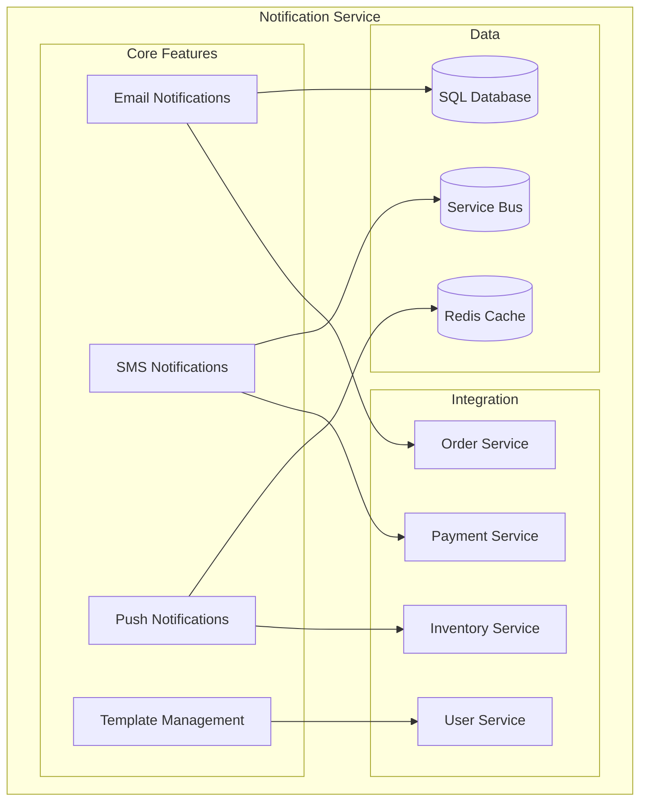
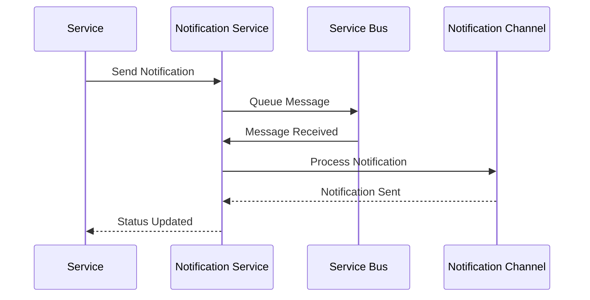
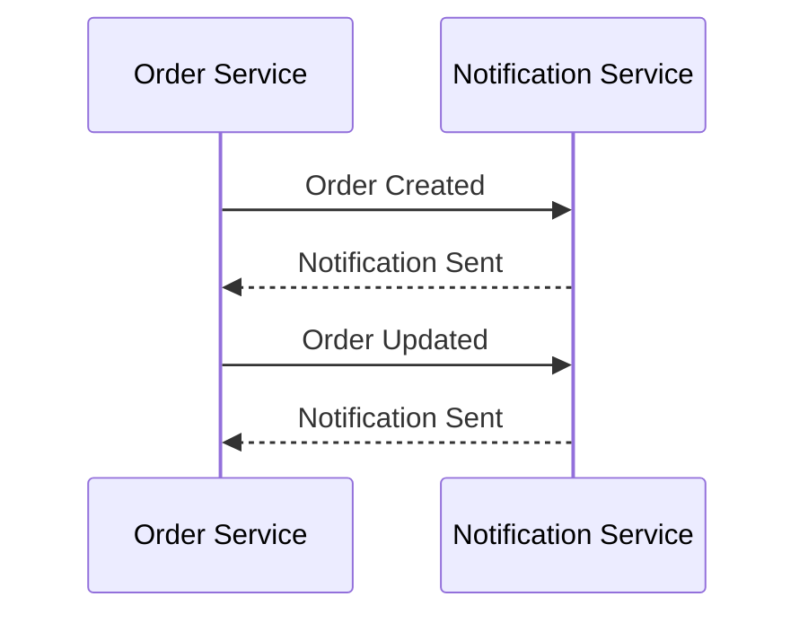
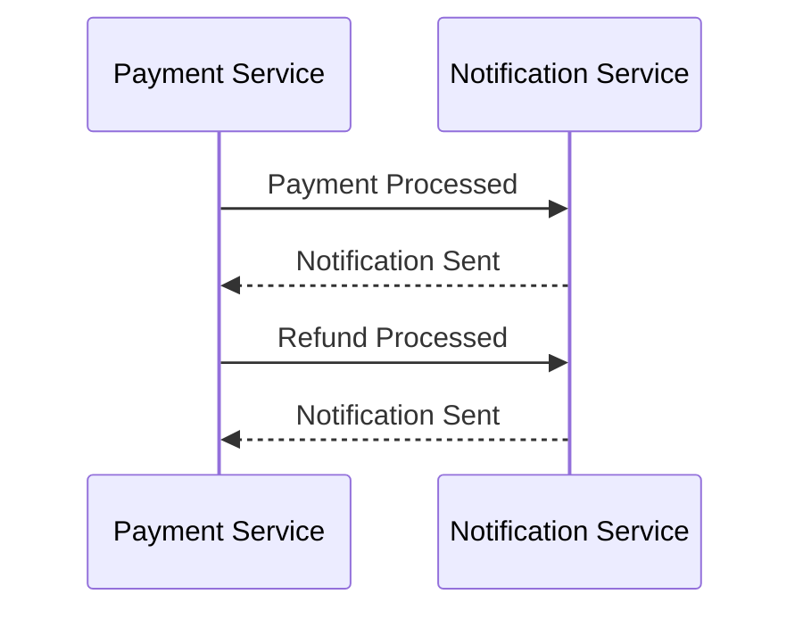

# Notification Service Documentation

## Overview
The Notification Service manages multi-channel notifications, including email, SMS, and push notifications, for the E-Commerce platform.

## Architecture


## Data Models

### Notification
```csharp
public class Notification
{
    public int Id { get; set; }
    public string Type { get; set; }
    public string Recipient { get; set; }
    public string Subject { get; set; }
    public string Content { get; set; }
    public string Status { get; set; }
    public DateTime CreatedAt { get; set; }
    public DateTime? SentAt { get; set; }
    public string ErrorMessage { get; set; }
}
```

### NotificationTemplate
```csharp
public class NotificationTemplate
{
    public int Id { get; set; }
    public string Name { get; set; }
    public string Type { get; set; }
    public string Subject { get; set; }
    public string Body { get; set; }
    public bool IsActive { get; set; }
    public DateTime CreatedAt { get; set; }
    public DateTime? UpdatedAt { get; set; }
}
```

## Notification Workflow


## API Endpoints

### Notifications
- `GET /api/notifications` - Get all notifications
- `GET /api/notifications/{id}` - Get notification by ID
- `POST /api/notifications` - Send notification
- `GET /api/notifications/user/{userId}` - Get user notifications

### Templates
- `GET /api/templates` - Get all templates
- `GET /api/templates/{id}` - Get template by ID
- `POST /api/templates` - Create template
- `PUT /api/templates/{id}` - Update template
- `DELETE /api/templates/{id}` - Delete template

## Configuration

### Email
```json
{
  "Email": {
    "SmtpServer": "smtp.gmail.com",
    "Port": 587,
    "Username": "your_email",
    "Password": "your_password",
    "FromAddress": "noreply@yourdomain.com"
  }
}
```

### SMS
```json
{
  "SMS": {
    "Provider": "Twilio",
    "AccountSid": "your_account_sid",
    "AuthToken": "your_auth_token",
    "FromNumber": "your_phone_number"
  }
}
```

### Push
```json
{
  "Push": {
    "Provider": "Firebase",
    "ServerKey": "your_server_key",
    "SenderId": "your_sender_id"
  }
}
```

## Health Checks

### Service Health
```csharp
services.AddHealthChecks()
    .AddDbContextCheck<NotificationsDbContext>()
    .AddCheck<NotificationsHealthCheck>("notifications_health_check");
```

### Channel Health
```csharp
services.AddHealthChecks()
    .AddSmtpHealthCheck("smtp.gmail.com", 587)
    .AddTwilioHealthCheck("your_account_sid", "your_auth_token");
```

## Monitoring

### Metrics
```csharp
services.AddPrometheusMetrics(options =>
{
    options.EnableHttpMetrics = true;
    options.EnableGcMetrics = true;
});
```

### Logging
```csharp
services.AddLogging(builder =>
{
    builder.AddConsole();
    builder.AddApplicationInsights();
});
```

## Integration

### Order Service


### Payment Service


## Development

### Prerequisites
- .NET 7.0 SDK
- SQL Server
- Email Service (e.g., Gmail)
- SMS Service (e.g., Twilio)
- Push Service (e.g., Firebase)

### Setup
1. Install dependencies:
   ```powershell
   dotnet add package Microsoft.EntityFrameworkCore.SqlServer
   dotnet add package Microsoft.EntityFrameworkCore.Tools
   dotnet add package MailKit
   dotnet add package Twilio
   dotnet add package FirebaseAdmin
   ```

2. Configure environment:
   ```powershell
   $env:ASPNETCORE_ENVIRONMENT = "Development"
   ```

3. Run migrations:
   ```powershell
   dotnet ef migrations add InitialCreate
   dotnet ef database update
   ```

4. Start service:
   ```powershell
   dotnet run --project services/notification-service/NotificationService.csproj
   ```

## Testing

### Unit Tests
```csharp
[Fact]
public async Task SendEmail_ReturnsSuccess_WhenValid()
{
    // Arrange
    var notification = new SendNotificationDto { Type = "Email", Recipient = "test@example.com" };
    _mockService.Setup(s => s.SendNotificationAsync(notification)).ReturnsAsync(true);

    // Act
    var result = await _controller.SendNotification(notification);

    // Assert
    Assert.True(result);
}
```

### Integration Tests
```csharp
[Fact]
public async Task SendSMS_UpdatesStatus_WhenSent()
{
    // Arrange
    var notification = new Notification { Id = 1, Status = "Pending" };

    // Act
    var response = await _client.PostAsJsonAsync("/api/notifications", notification);

    // Assert
    response.EnsureSuccessStatusCode();
    var updatedNotification = await response.Content.ReadFromJsonAsync<Notification>();
    Assert.Equal("Sent", updatedNotification.Status);
}
```

## Templates

### Email Template
```html
<!DOCTYPE html>
<html>
<head>
    <title>{{Subject}}</title>
</head>
<body>
    <h1>{{Greeting}}</h1>
    <p>{{Content}}</p>
    <footer>
        <p>Best regards,<br>Your E-Commerce Team</p>
    </footer>
</body>
</html>
```

### SMS Template
```
{{Greeting}},

{{Content}}

Thank you,
Your E-Commerce Team
```

## Troubleshooting

### Common Issues
1. **Email Delivery**
   - Check SMTP settings
   - Verify email credentials
   - Monitor spam filters

2. **SMS Delivery**
   - Check provider status
   - Verify phone numbers
   - Monitor rate limits

3. **Push Notifications**
   - Check device tokens
   - Verify API keys
   - Monitor delivery status

4. **Template Rendering**
   - Check template syntax
   - Verify data binding
   - Monitor rendering errors

## Support
- [MailKit Documentation](https://github.com/jstedfast/MailKit)
- [Twilio Documentation](https://www.twilio.com/docs)
- [Firebase Documentation](https://firebase.google.com/docs)
- [Issue Tracking](.github/ISSUE_TEMPLATE.md)

<div align="center">
  <p>
    <em>© 2024 Lear Cyber Tech. All rights reserved.</em>
  </p>
</div> 