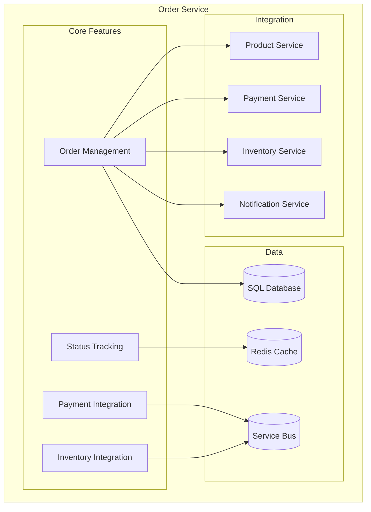
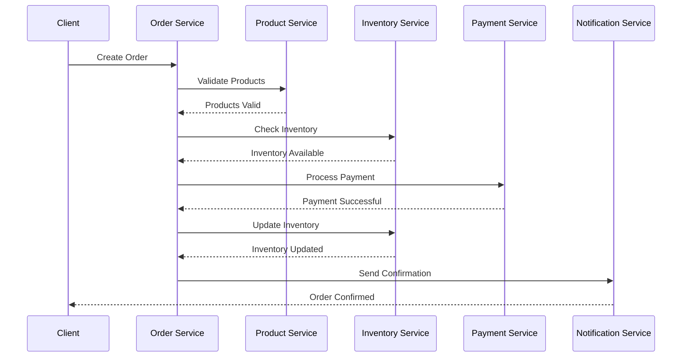
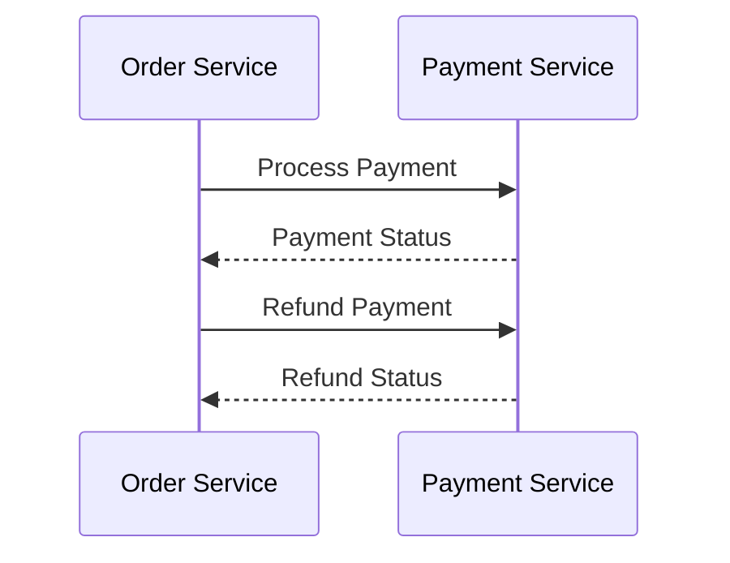
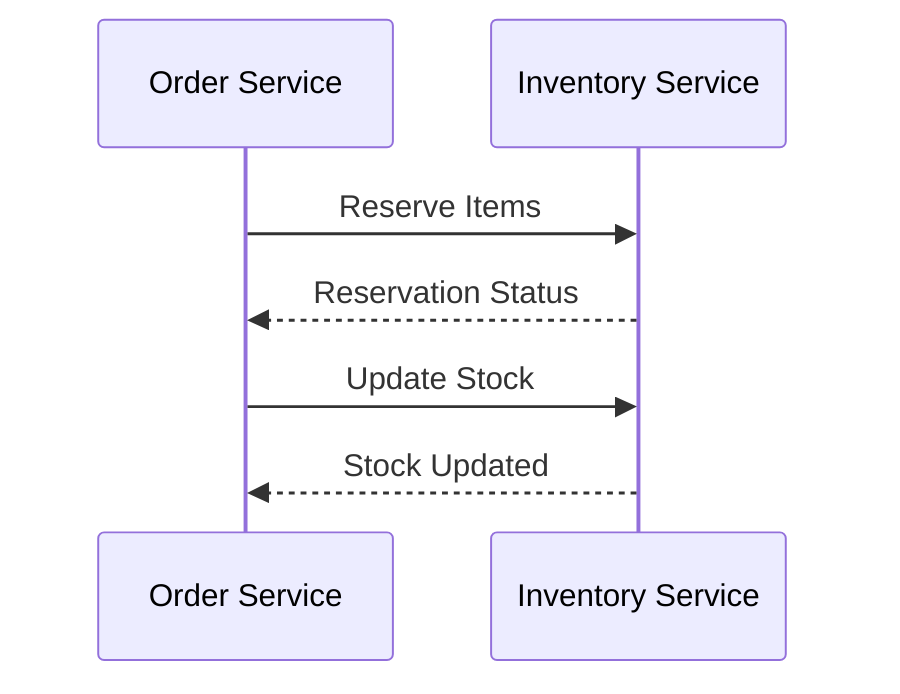

# Order Service Documentation

## Overview
The Order Service manages the order processing workflow, including order creation, status updates, and integration with payment and inventory services.

## Architecture


## Data Models

### Order
```csharp
public class Order
{
    public int Id { get; set; }
    public string OrderNumber { get; set; }
    public int UserId { get; set; }
    public User User { get; set; }
    public List<OrderItem> Items { get; set; }
    public decimal TotalAmount { get; set; }
    public string Status { get; set; }
    public string ShippingAddress { get; set; }
    public string BillingAddress { get; set; }
    public DateTime CreatedAt { get; set; }
    public DateTime? UpdatedAt { get; set; }
}
```

### OrderItem
```csharp
public class OrderItem
{
    public int Id { get; set; }
    public int OrderId { get; set; }
    public Order Order { get; set; }
    public int ProductId { get; set; }
    public Product Product { get; set; }
    public int Quantity { get; set; }
    public decimal UnitPrice { get; set; }
    public decimal TotalPrice { get; set; }
}
```

## Order Workflow


## API Endpoints

### Orders
- `GET /api/orders` - Get all orders
- `GET /api/orders/{id}` - Get order by ID
- `POST /api/orders` - Create new order
- `PUT /api/orders/{id}` - Update order
- `PUT /api/orders/{id}/status` - Update order status
- `GET /api/orders/user/{userId}` - Get user orders

### Order Items
- `GET /api/orders/{orderId}/items` - Get order items
- `POST /api/orders/{orderId}/items` - Add item to order
- `PUT /api/orders/{orderId}/items/{itemId}` - Update order item
- `DELETE /api/orders/{orderId}/items/{itemId}` - Remove item from order

## Configuration

### Database
```json
{
  "ConnectionStrings": {
    "DefaultConnection": "Server=localhost;Database=ECommerce;User Id=sa;Password=your_password;"
  }
}
```

### Service Bus
```json
{
  "AzureServiceBus": {
    "ConnectionString": "your_service_bus_connection_string",
    "QueueName": "orders"
  }
}
```

### Redis Cache
```json
{
  "Redis": {
    "ConnectionString": "localhost:6379",
    "InstanceName": "Orders:"
  }
}
```

## Health Checks

### Database Health
```csharp
services.AddHealthChecks()
    .AddDbContextCheck<OrdersDbContext>()
    .AddCheck<OrdersHealthCheck>("orders_health_check");
```

### Service Bus Health
```csharp
services.AddHealthChecks()
    .AddAzureServiceBusQueue("your_service_bus_connection_string", "orders");
```

## Monitoring

### Metrics
```csharp
services.AddPrometheusMetrics(options =>
{
    options.EnableHttpMetrics = true;
    options.EnableGcMetrics = true;
});
```

### Logging
```csharp
services.AddLogging(builder =>
{
    builder.AddConsole();
    builder.AddApplicationInsights();
});
```

## Integration

### Payment Service


### Inventory Service


## Development

### Prerequisites
- .NET 7.0 SDK
- SQL Server
- Azure Service Bus
- Redis Cache

### Setup
1. Install dependencies:
   ```powershell
   dotnet add package Microsoft.EntityFrameworkCore.SqlServer
   dotnet add package Microsoft.EntityFrameworkCore.Tools
   dotnet add package Azure.Messaging.ServiceBus
   dotnet add package StackExchange.Redis
   ```

2. Configure environment:
   ```powershell
   $env:ASPNETCORE_ENVIRONMENT = "Development"
   ```

3. Run migrations:
   ```powershell
   dotnet ef migrations add InitialCreate
   dotnet ef database update
   ```

4. Start service:
   ```powershell
   dotnet run --project services/order-service/OrderService.csproj
   ```

## Testing

### Unit Tests
```csharp
[Fact]
public async Task CreateOrder_ReturnsOrder_WhenValid()
{
    // Arrange
    var order = new CreateOrderDto { UserId = 1, Items = new List<OrderItemDto>() };
    _mockService.Setup(s => s.CreateOrderAsync(order)).ReturnsAsync(new Order());

    // Act
    var result = await _controller.CreateOrder(order);

    // Assert
    Assert.NotNull(result);
    Assert.IsType<CreatedAtActionResult>(result);
}
```

### Integration Tests
```csharp
[Fact]
public async Task ProcessOrder_UpdatesStatus_WhenPaymentSuccessful()
{
    // Arrange
    var order = new Order { Id = 1, Status = "Pending" };

    // Act
    var response = await _client.PutAsJsonAsync($"/api/orders/{order.Id}/status", "Processing");

    // Assert
    response.EnsureSuccessStatusCode();
    var updatedOrder = await response.Content.ReadFromJsonAsync<Order>();
    Assert.Equal("Processing", updatedOrder.Status);
}
```

## Troubleshooting

### Common Issues
1. **Order Creation**
   - Verify product availability
   - Check inventory levels
   - Validate payment processing

2. **Status Updates**
   - Check workflow transitions
   - Verify service integration
   - Monitor event processing

3. **Service Integration**
   - Check service bus connection
   - Verify message format
   - Monitor queue health

4. **Performance**
   - Monitor database queries
   - Check cache usage
   - Optimize workflow

## Support
- [Entity Framework Core Documentation](https://docs.microsoft.com/en-us/ef/core/)
- [Azure Service Bus Documentation](https://docs.microsoft.com/en-us/azure/service-bus/)
- [Redis Documentation](https://redis.io/documentation)
- [Issue Tracking](.github/ISSUE_TEMPLATE.md)

<div align="center">
  <p>
    <em>© 2024 Lear Cyber Tech. All rights reserved.</em>
  </p>
</div> 