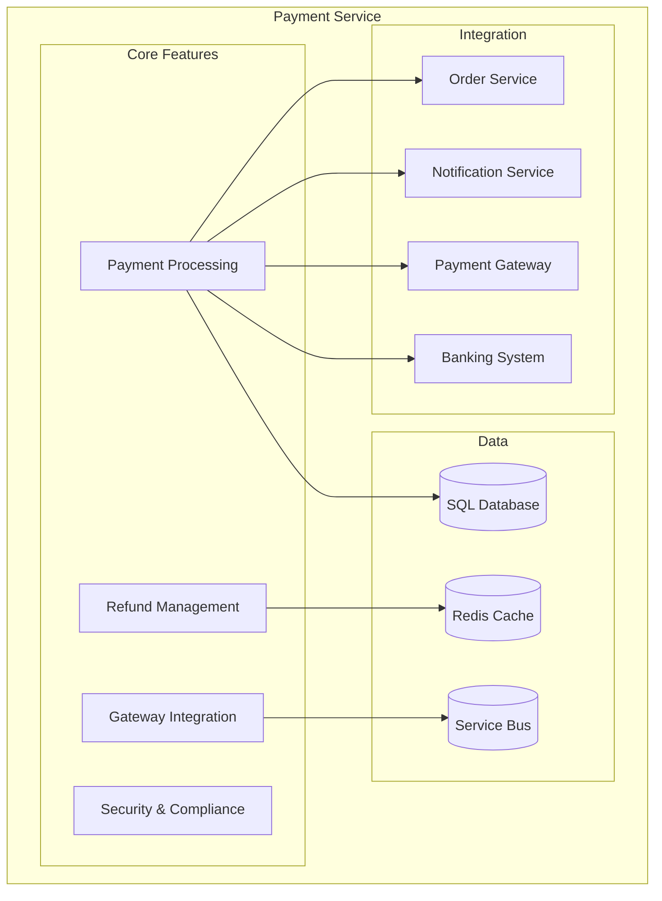
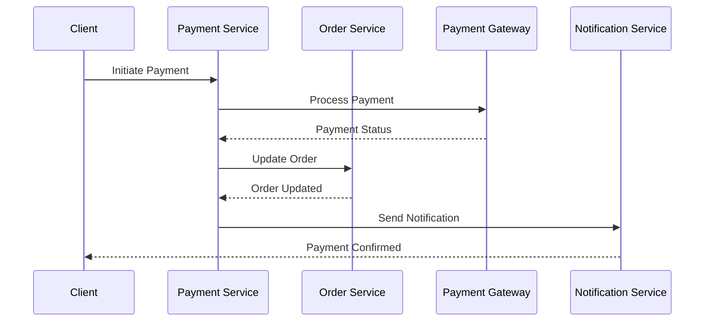
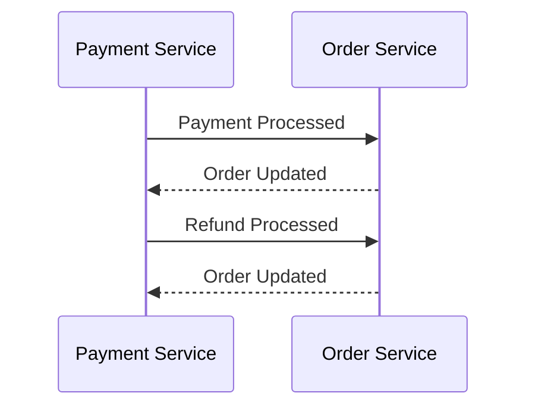
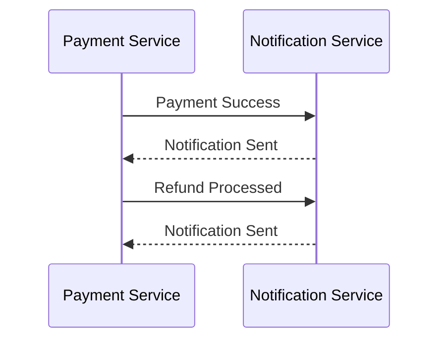

# Payment Service Documentation

## Overview
The Payment Service handles payment processing, transaction management, and integration with payment gateways for the E-Commerce platform.

## Architecture


## Data Models

### Payment
```csharp
public class Payment
{
    public int Id { get; set; }
    public string PaymentId { get; set; }
    public int OrderId { get; set; }
    public Order Order { get; set; }
    public decimal Amount { get; set; }
    public string Currency { get; set; }
    public string Status { get; set; }
    public string PaymentMethod { get; set; }
    public string TransactionId { get; set; }
    public DateTime CreatedAt { get; set; }
    public DateTime? UpdatedAt { get; set; }
}
```

### PaymentMethod
```csharp
public class PaymentMethod
{
    public int Id { get; set; }
    public int UserId { get; set; }
    public User User { get; set; }
    public string Type { get; set; }
    public string Details { get; set; }
    public bool IsDefault { get; set; }
    public DateTime CreatedAt { get; set; }
    public DateTime? UpdatedAt { get; set; }
}
```

## Payment Workflow


## API Endpoints

### Payments
- `GET /api/payments` - Get all payments
- `GET /api/payments/{id}` - Get payment by ID
- `POST /api/payments` - Process payment
- `POST /api/payments/{id}/refund` - Process refund
- `GET /api/payments/order/{orderId}` - Get order payments

### Payment Methods
- `GET /api/payment-methods` - Get user payment methods
- `POST /api/payment-methods` - Add payment method
- `PUT /api/payment-methods/{id}` - Update payment method
- `DELETE /api/payment-methods/{id}` - Remove payment method

## Configuration

### Database
```json
{
  "ConnectionStrings": {
    "DefaultConnection": "Server=localhost;Database=ECommerce;User Id=sa;Password=your_password;"
  }
}
```

### Payment Gateway
```json
{
  "PaymentGateway": {
    "Provider": "Stripe",
    "ApiKey": "your_api_key",
    "WebhookSecret": "your_webhook_secret"
  }
}
```

### Service Bus
```json
{
  "AzureServiceBus": {
    "ConnectionString": "your_service_bus_connection_string",
    "QueueName": "payments"
  }
}
```

## Health Checks

### Database Health
```csharp
services.AddHealthChecks()
    .AddDbContextCheck<PaymentsDbContext>()
    .AddCheck<PaymentsHealthCheck>("payments_health_check");
```

### Payment Gateway Health
```csharp
services.AddHealthChecks()
    .AddCheck<PaymentGatewayHealthCheck>("payment_gateway_health_check");
```

## Monitoring

### Metrics
```csharp
services.AddPrometheusMetrics(options =>
{
    options.EnableHttpMetrics = true;
    options.EnableGcMetrics = true;
});
```

### Logging
```csharp
services.AddLogging(builder =>
{
    builder.AddConsole();
    builder.AddApplicationInsights();
});
```

## Integration

### Order Service


### Notification Service


## Development

### Prerequisites
- .NET 7.0 SDK
- SQL Server
- Payment Gateway Account
- Azure Service Bus

### Setup
1. Install dependencies:
   ```powershell
   dotnet add package Microsoft.EntityFrameworkCore.SqlServer
   dotnet add package Microsoft.EntityFrameworkCore.Tools
   dotnet add package Stripe.net
   dotnet add package Azure.Messaging.ServiceBus
   ```

2. Configure environment:
   ```powershell
   $env:ASPNETCORE_ENVIRONMENT = "Development"
   ```

3. Run migrations:
   ```powershell
   dotnet ef migrations add InitialCreate
   dotnet ef database update
   ```

4. Start service:
   ```powershell
   dotnet run --project services/payment-service/PaymentService.csproj
   ```

## Testing

### Unit Tests
```csharp
[Fact]
public async Task ProcessPayment_ReturnsPayment_WhenValid()
{
    // Arrange
    var payment = new ProcessPaymentDto { OrderId = 1, Amount = 100.00m };
    _mockService.Setup(s => s.ProcessPaymentAsync(payment)).ReturnsAsync(new Payment());

    // Act
    var result = await _controller.ProcessPayment(payment);

    // Assert
    Assert.NotNull(result);
    Assert.IsType<CreatedAtActionResult>(result);
}
```

### Integration Tests
```csharp
[Fact]
public async Task ProcessRefund_UpdatesStatus_WhenValid()
{
    // Arrange
    var payment = new Payment { Id = 1, Status = "Completed" };

    // Act
    var response = await _client.PostAsJsonAsync($"/api/payments/{payment.Id}/refund", new RefundDto());

    // Assert
    response.EnsureSuccessStatusCode();
    var updatedPayment = await response.Content.ReadFromJsonAsync<Payment>();
    Assert.Equal("Refunded", updatedPayment.Status);
}
```

## Security

### PCI Compliance
- Encrypt sensitive data
- Secure API endpoints
- Regular security audits
- Compliance monitoring

### Data Protection
```csharp
services.AddDataProtection()
    .PersistKeysToAzureBlobStorage(new Uri("your_blob_uri"))
    .ProtectKeysWithAzureKeyVault(new Uri("your_key_vault_uri"), new DefaultAzureCredential());
```

## Troubleshooting

### Common Issues
1. **Payment Processing**
   - Verify gateway connection
   - Check API credentials
   - Validate payment data

2. **Refund Processing**
   - Check transaction status
   - Verify refund amount
   - Monitor gateway response

3. **Service Integration**
   - Check service bus connection
   - Verify message format
   - Monitor queue health

4. **Security**
   - Monitor failed attempts
   - Check encryption status
   - Validate compliance

## Support
- [Stripe Documentation](https://stripe.com/docs)
- [Azure Service Bus Documentation](https://docs.microsoft.com/en-us/azure/service-bus/)
- [PCI Compliance Guide](https://www.pcisecuritystandards.org/)
- [Issue Tracking](.github/ISSUE_TEMPLATE.md)

<div align="center">
  <p>
    <em>© 2024 Lear Cyber Tech. All rights reserved.</em>
  </p>
</div> 