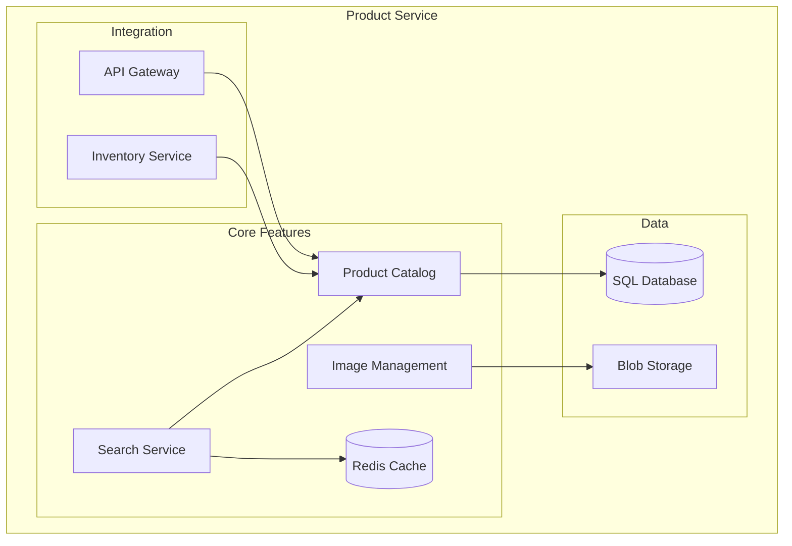
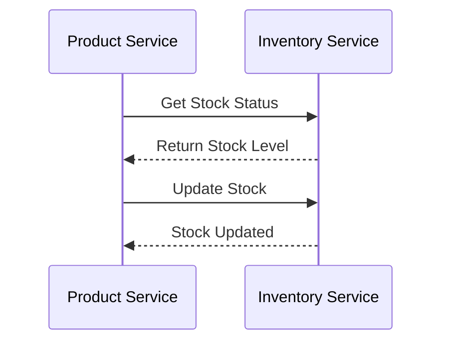
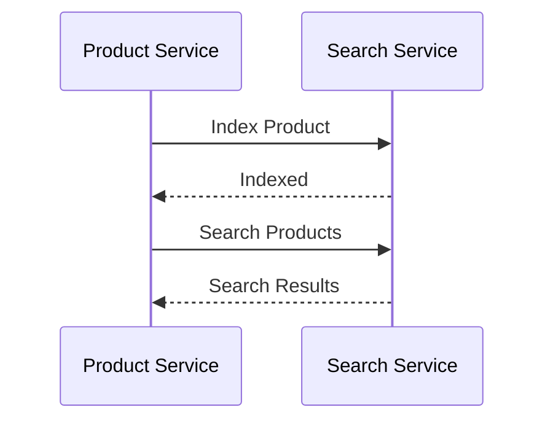

# Product Service Documentation

## Overview
The Product Service manages the product catalog for the E-Commerce platform, including product information, images, and inventory status.

## Architecture


## Data Models

### Product
```csharp
public class Product
{
    public int Id { get; set; }
    public string Name { get; set; }
    public string Description { get; set; }
    public decimal Price { get; set; }
    public int StockQuantity { get; set; }
    public string ImageUrl { get; set; }
    public string Category { get; set; }
    public bool IsActive { get; set; }
    public DateTime CreatedAt { get; set; }
    public DateTime? UpdatedAt { get; set; }
}
```

### Category
```csharp
public class Category
{
    public int Id { get; set; }
    public string Name { get; set; }
    public string Description { get; set; }
    public int? ParentId { get; set; }
    public List<Product> Products { get; set; }
}
```

## API Endpoints

### Products
- `GET /api/products` - Get all products
- `GET /api/products/{id}` - Get product by ID
- `POST /api/products` - Create new product
- `PUT /api/products/{id}` - Update product
- `DELETE /api/products/{id}` - Delete product
- `GET /api/products/search` - Search products

### Categories
- `GET /api/categories` - Get all categories
- `GET /api/categories/{id}` - Get category by ID
- `POST /api/categories` - Create new category
- `PUT /api/categories/{id}` - Update category
- `DELETE /api/categories/{id}` - Delete category

## Configuration

### Database
```json
{
  "ConnectionStrings": {
    "DefaultConnection": "Server=localhost;Database=ECommerce;User Id=sa;Password=your_password;"
  }
}
```

### Azure Storage
```json
{
  "AzureStorage": {
    "ConnectionString": "your_storage_connection_string",
    "ContainerName": "products"
  }
}
```

### Redis Cache
```json
{
  "Redis": {
    "ConnectionString": "localhost:6379",
    "InstanceName": "Products:"
  }
}
```

## Health Checks

### Database Health
```csharp
services.AddHealthChecks()
    .AddDbContextCheck<ProductsDbContext>()
    .AddCheck<ProductsHealthCheck>("products_health_check");
```

### Cache Health
```csharp
services.AddHealthChecks()
    .AddRedis("localhost:6379", name: "redis_health_check");
```

## Monitoring

### Metrics
```csharp
services.AddPrometheusMetrics(options =>
{
    options.EnableHttpMetrics = true;
    options.EnableGcMetrics = true;
});
```

### Logging
```csharp
services.AddLogging(builder =>
{
    builder.AddConsole();
    builder.AddApplicationInsights();
});
```

## Integration

### Inventory Service


### Search Service


## Development

### Prerequisites
- .NET 7.0 SDK
- SQL Server
- Azure Storage Account
- Redis Cache

### Setup
1. Install dependencies:
   ```powershell
   dotnet add package Microsoft.EntityFrameworkCore.SqlServer
   dotnet add package Microsoft.EntityFrameworkCore.Tools
   dotnet add package Azure.Storage.Blobs
   dotnet add package StackExchange.Redis
   ```

2. Configure environment:
   ```powershell
   $env:ASPNETCORE_ENVIRONMENT = "Development"
   ```

3. Run migrations:
   ```powershell
   dotnet ef migrations add InitialCreate
   dotnet ef database update
   ```

4. Start service:
   ```powershell
   dotnet run --project services/product-service/ProductService.csproj
   ```

## Testing

### Unit Tests
```csharp
[Fact]
public async Task GetProduct_ReturnsProduct_WhenProductExists()
{
    // Arrange
    var product = new Product { Id = 1, Name = "Test Product" };
    _mockRepository.Setup(r => r.GetByIdAsync(1)).ReturnsAsync(product);

    // Act
    var result = await _controller.GetProduct(1);

    // Assert
    Assert.NotNull(result);
    Assert.Equal(product.Name, result.Name);
}
```

### Integration Tests
```csharp
[Fact]
public async Task CreateProduct_ReturnsCreatedProduct()
{
    // Arrange
    var product = new CreateProductDto { Name = "New Product", Price = 99.99m };

    // Act
    var response = await _client.PostAsJsonAsync("/api/products", product);

    // Assert
    response.EnsureSuccessStatusCode();
    var createdProduct = await response.Content.ReadFromJsonAsync<Product>();
    Assert.NotNull(createdProduct);
    Assert.Equal(product.Name, createdProduct.Name);
}
```

## Troubleshooting

### Common Issues
1. **Database Connection**
   - Verify connection string
   - Check SQL Server status
   - Validate credentials

2. **Image Upload**
   - Check storage account access
   - Verify container permissions
   - Validate file types

3. **Cache Issues**
   - Check Redis connection
   - Verify cache keys
   - Monitor memory usage

4. **Performance**
   - Monitor query execution
   - Check cache hit ratio
   - Optimize database indexes

## Support
- [Entity Framework Core Documentation](https://docs.microsoft.com/en-us/ef/core/)
- [Azure Storage Documentation](https://docs.microsoft.com/en-us/azure/storage/)
- [Redis Documentation](https://redis.io/documentation)
- [Issue Tracking](.github/ISSUE_TEMPLATE.md)

<div align="center">
  <p>
    <em>© 2024 Lear Cyber Tech. All rights reserved.</em>
  </p>
</div> 