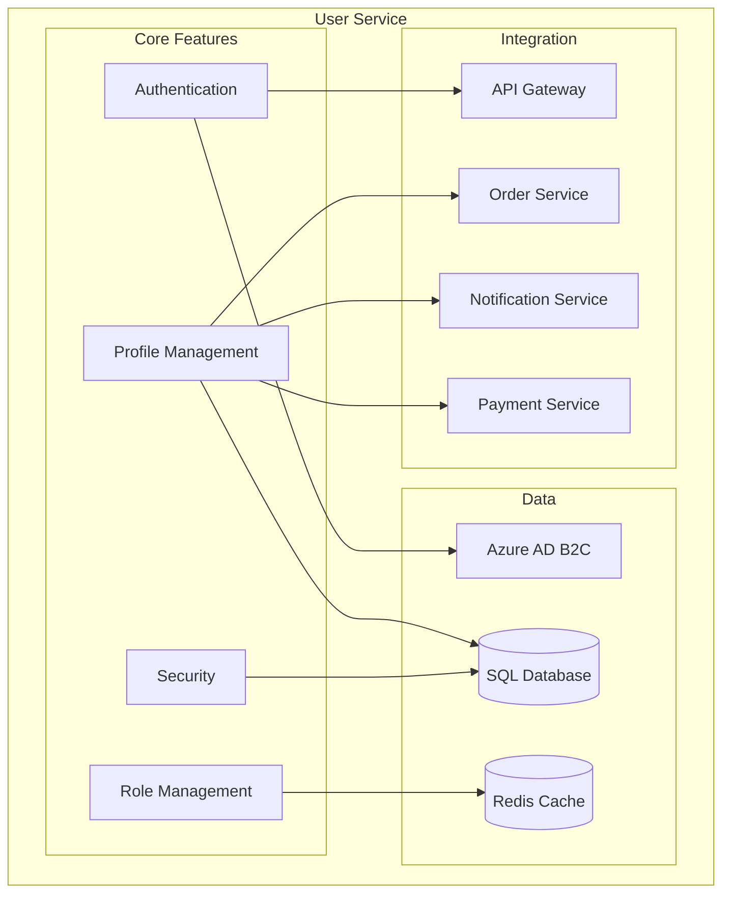
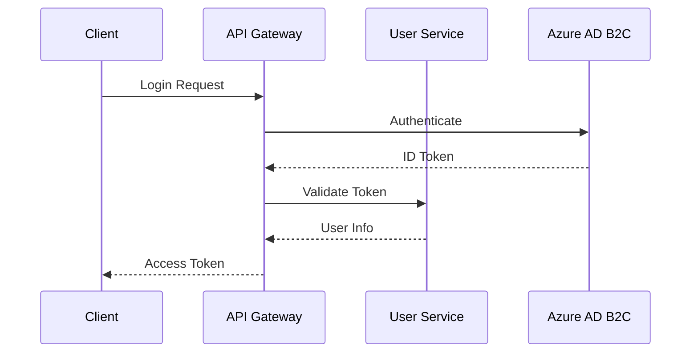
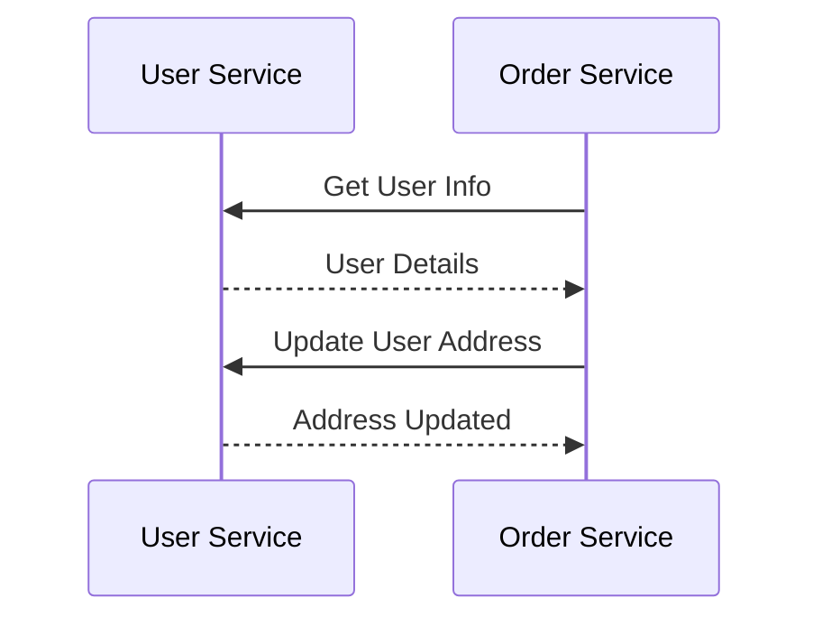
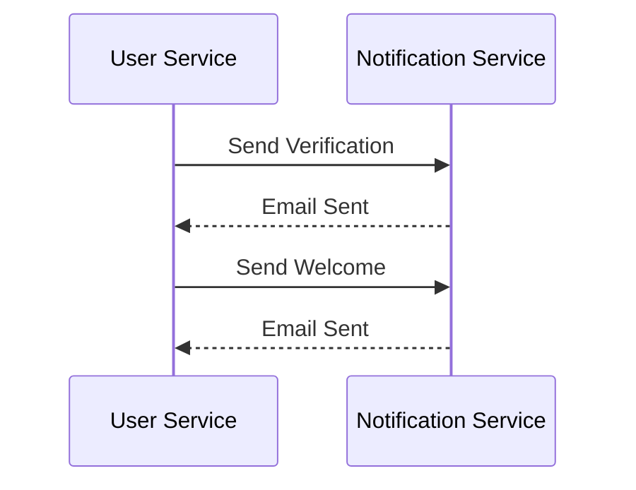

# User Service Documentation

## Overview
The User Service manages user accounts, authentication, and authorization for the E-Commerce platform, integrating with Azure AD B2C for identity management.

## Architecture


## Data Models

### User
```csharp
public class User
{
    public int Id { get; set; }
    public string ExternalId { get; set; }
    public string Email { get; set; }
    public string FirstName { get; set; }
    public string LastName { get; set; }
    public string PhoneNumber { get; set; }
    public string Address { get; set; }
    public List<UserRole> Roles { get; set; }
    public bool IsActive { get; set; }
    public DateTime CreatedAt { get; set; }
    public DateTime? UpdatedAt { get; set; }
}
```

### UserRole
```csharp
public class UserRole
{
    public int Id { get; set; }
    public int UserId { get; set; }
    public User User { get; set; }
    public string Role { get; set; }
    public DateTime CreatedAt { get; set; }
}
```

## Authentication Flow


## API Endpoints

### Authentication
- `POST /api/auth/login` - User login
- `POST /api/auth/register` - User registration
- `POST /api/auth/refresh` - Refresh token
- `POST /api/auth/logout` - User logout

### Users
- `GET /api/users` - Get all users
- `GET /api/users/{id}` - Get user by ID
- `POST /api/users` - Create user
- `PUT /api/users/{id}` - Update user
- `DELETE /api/users/{id}` - Delete user

### Roles
- `GET /api/roles` - Get all roles
- `POST /api/roles` - Create role
- `PUT /api/roles/{id}` - Update role
- `DELETE /api/roles/{id}` - Delete role
- `POST /api/users/{userId}/roles` - Assign role

## Configuration

### Azure AD B2C
```json
{
  "AzureAdB2C": {
    "Instance": "https://your-tenant.b2clogin.com",
    "ClientId": "your-client-id",
    "Domain": "your-tenant.onmicrosoft.com",
    "SignUpSignInPolicyId": "B2C_1_SignUpSignIn"
  }
}
```

### Database
```json
{
  "ConnectionStrings": {
    "DefaultConnection": "Server=localhost;Database=ECommerce;User Id=sa;Password=your_password;"
  }
}
```

### Redis Cache
```json
{
  "Redis": {
    "ConnectionString": "localhost:6379",
    "InstanceName": "Users:"
  }
}
```

## Health Checks

### Database Health
```csharp
services.AddHealthChecks()
    .AddDbContextCheck<UsersDbContext>()
    .AddCheck<UsersHealthCheck>("users_health_check");
```

### Azure AD B2C Health
```csharp
services.AddHealthChecks()
    .AddAzureAdB2CHealthCheck("your-tenant.b2clogin.com");
```

## Monitoring

### Metrics
```csharp
services.AddPrometheusMetrics(options =>
{
    options.EnableHttpMetrics = true;
    options.EnableGcMetrics = true;
});
```

### Logging
```csharp
services.AddLogging(builder =>
{
    builder.AddConsole();
    builder.AddApplicationInsights();
});
```

## Security

### Password Policy
```json
{
  "PasswordPolicy": {
    "RequiredLength": 8,
    "RequireUppercase": true,
    "RequireLowercase": true,
    "RequireDigit": true,
    "RequireSpecialCharacter": true,
    "MaxFailedAccessAttempts": 5,
    "LockoutDuration": 15
  }
}
```

### JWT Configuration
```json
{
  "Jwt": {
    "Issuer": "your-issuer",
    "Audience": "your-audience",
    "Key": "your-secret-key",
    "ExpiryInMinutes": 60
  }
}
```

## Integration

### Order Service


### Notification Service


## Development

### Prerequisites
- .NET 7.0 SDK
- SQL Server
- Azure AD B2C Tenant
- Redis Cache

### Setup
1. Install dependencies:
   ```powershell
   dotnet add package Microsoft.EntityFrameworkCore.SqlServer
   dotnet add package Microsoft.EntityFrameworkCore.Tools
   dotnet add package Microsoft.AspNetCore.Authentication.JwtBearer
   dotnet add package StackExchange.Redis
   ```

2. Configure environment:
   ```powershell
   $env:ASPNETCORE_ENVIRONMENT = "Development"
   ```

3. Run migrations:
   ```powershell
   dotnet ef migrations add InitialCreate
   dotnet ef database update
   ```

4. Start service:
   ```powershell
   dotnet run --project services/user-service/UserService.csproj
   ```

## Testing

### Unit Tests
```csharp
[Fact]
public async Task RegisterUser_ReturnsUser_WhenValid()
{
    // Arrange
    var user = new RegisterUserDto { Email = "test@example.com", Password = "Password123!" };
    _mockService.Setup(s => s.RegisterUserAsync(user)).ReturnsAsync(new User());

    // Act
    var result = await _controller.RegisterUser(user);

    // Assert
    Assert.NotNull(result);
    Assert.IsType<CreatedAtActionResult>(result);
}
```

### Integration Tests
```csharp
[Fact]
public async Task Login_ReturnsToken_WhenValid()
{
    // Arrange
    var credentials = new LoginDto { Email = "test@example.com", Password = "Password123!" };

    // Act
    var response = await _client.PostAsJsonAsync("/api/auth/login", credentials);

    // Assert
    response.EnsureSuccessStatusCode();
    var result = await response.Content.ReadFromJsonAsync<AuthResponse>();
    Assert.NotNull(result.Token);
}
```

## Troubleshooting

### Common Issues
1. **Authentication**
   - Check Azure AD B2C configuration
   - Verify token validation
   - Monitor failed attempts

2. **User Management**
   - Check database connection
   - Verify role assignments
   - Monitor profile updates

3. **Security**
   - Check password policies
   - Verify encryption
   - Monitor access logs

4. **Performance**
   - Monitor cache usage
   - Check query execution
   - Optimize database indexes

## Support
- [Azure AD B2C Documentation](https://docs.microsoft.com/en-us/azure/active-directory-b2c/)
- [Entity Framework Core Documentation](https://docs.microsoft.com/en-us/ef/core/)
- [JWT Documentation](https://jwt.io/introduction/)
- [Issue Tracking](.github/ISSUE_TEMPLATE.md)

<div align="center">
  <p>
    <em>© 2024 Lear Cyber Tech. All rights reserved.</em>
  </p>
</div> 